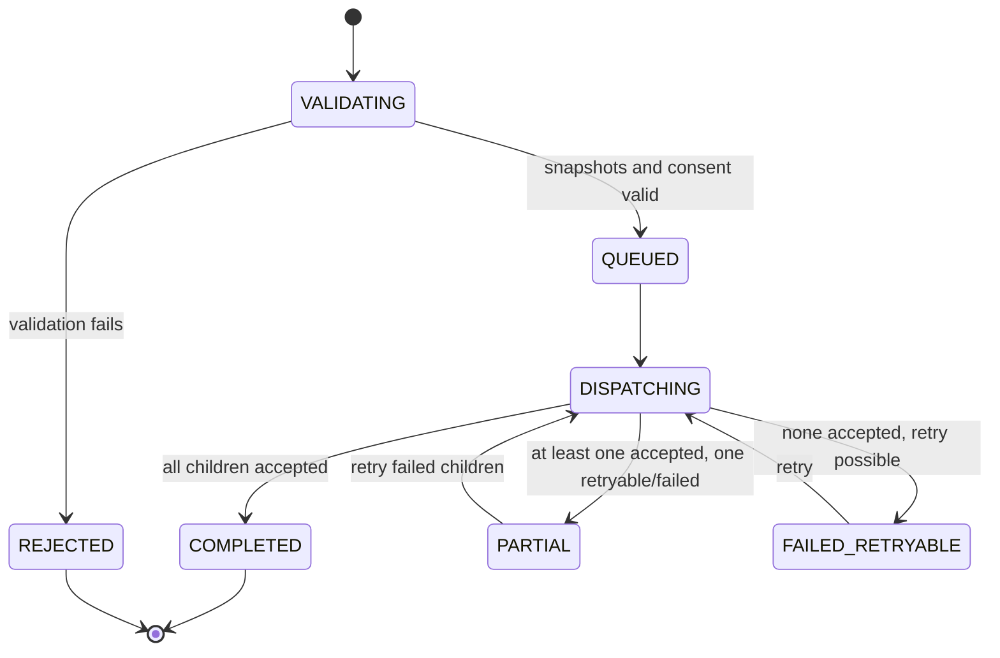

# KrishiSetu API Contract and DPI Data Flows

**API base path:** `/api/v1`  
**Mock provider base path:** `/mock`  
**Media type:** `application/json; charset=utf-8`  
**Identifiers:** strings, including all 14-digit identifiers  
**Money:** integer paise on the wire, plus localized display strings created by the frontend  
**Dates:** ISO 8601; timestamps include an offset or `Z`

## 0. Modular/localization amendment

This contract is implemented through the bounded modules in `KRISHISETU-MODULAR-FOUNDATION-ARCHITECTURE.md`. That document supersedes any implied shared-table access or flat folder layout in older examples.

Localization rules for all routes:

- `packages/i18n/src/locale-registry.ts` is the only source for supported/default locales.
- English (`en`) is the configurable default; `en`, `mr`, `hi`, and `kn` are supported.
- APIs return stable codes, `messageKey`, and structured `facts`. The generated client/localization layer renders citizen-facing text.
- A server-rendered fallback `message` may be included for non-web clients only when resolved through `@krishisetu/i18n`; it is never hardcoded in a handler.
- Bilingual objects shown in older JSON examples are illustrative research-era payloads. Implementations should prefer locale-neutral codes and a selected `displayText`, or a validated `translations: Partial<Record<Locale, string>>` only for provider-owned proper text.
- Locale resolution and persistence follow the modular architecture; no route declares its own default.

## 1. Contract conventions

### 1.1 Standard headers

| Header | Direction | Required | Meaning |
|---|---|---:|---|
| `Cookie: krishi_session=...` | Request | Protected routes | Secure mock session JWT |
| `X-CSRF-Token` | Request | Mutations | Token bound to session and verified with Origin |
| `X-Consent-Id` | Request | Consent-protected reads/writes | Active purpose-specific consent UUID |
| `Idempotency-Key` | Request | Application submit/retry | Client UUID retained for 24 hours |
| `X-Request-Id` | Both | Generated if absent | Request trace identifier |
| `X-Correlation-Id` | Response | Yes | End-to-end fan-out/bundle trace identifier |
| `Cache-Control: no-store` | Response | Private routes | Prevent browser/proxy persistence |

### 1.2 Standard error

```json
{
  "error": {
    "code": "CONSENT_SCOPE_MISSING",
    "messageKey": "errors.consent.scopeMissing",
    "message": "Permission to use credit data is missing.",
    "details": {
      "requiredScopes": ["CREDIT_READ"],
      "grantedScopes": ["IDENTITY_READ", "LAND_READ", "CROP_READ"]
    },
    "retryable": false,
    "requestId": "req_01J5ZK2JBQY2G4QW7X6N2V8R8A"
  }
}
```

Provider error strings are never forwarded directly. The gateway maps them to an allowlisted citizen-facing error code and `messageKey`.

## 2. Route inventory

### 2.1 Public citizen API

| Method | Route | Consent | Purpose |
|---|---|---|---|
| `GET` | `/health/live` | No | Process liveness |
| `GET` | `/health/ready` | No | Migration/database readiness |
| `GET` | `/meta/locales` | No | Discover locales from the authoritative locale registry |
| `GET` | `/meta/modules` | No | Discover enabled public capabilities from the module registry |
| `POST` | `/auth/login` | No | Synthetic Farmer ID + demo PIN login |
| `POST` | `/auth/logout` | No | Invalidate session and clear cookie |
| `GET` | `/users/me` | Session | Current user and safe preferences |
| `PATCH` | `/users/me/preferences` | Session | Update locale/accessibility preferences |
| `POST` | `/consents` | Session | Create and sign consent artefact |
| `GET` | `/consents/current` | Session | Show active consent and scopes |
| `DELETE` | `/consents/{consentId}` | Session/owner | Revoke and synchronously purge prototype copies |
| `GET` | `/dashboard` | `DASHBOARD_VIEW` | Fan-out/fan-in composite dashboard |
| `POST` | `/dashboard/refresh` | Relevant scopes | Retry named failed domains |
| `POST` | `/application-bundles` | `MULTI_SCHEME_APPLICATION` | Submit subsidy + KCC bundle |
| `GET` | `/application-bundles/{bundleId}` | Same consent/owner | Fetch parent and child states |
| `POST` | `/application-bundles/{bundleId}/retry` | Same consent/owner | Retry only failed/retryable child operations |
| `POST` | `/demo/reset` | Demo reset token | Rebuild current synthetic persona state |

### 2.2 Exposed mock-provider routes

These routes exist so reviewers can see and test the simulated boundary. The gateway uses the same services through adapters rather than making loopback HTTP calls.

| Method | Route | Simulates |
|---|---|---|
| `GET` | `/mock/farmer-registry/v1/farmers/{farmerId}` | Farmer Registry identity |
| `GET` | `/mock/mahabhumi/v1/land-holdings/{farmerId}` | UFSI land/7/12 provider |
| `GET` | `/mock/crop-registry/v1/crops/{farmerId}` | Crop Sown Registry/e-Pik |
| `POST` | `/mock/mahadbt/v1/eligibility:check` | MahaDBT eligibility engine |
| `POST` | `/mock/mahadbt/v1/applications` | MahaDBT submission |
| `POST` | `/mock/uli/v1/credit-estimates` | ULI/KCC estimate |
| `POST` | `/mock/uli/v1/pre-applications` | ULI pre-application submission |

Provider routes require an internal mock-service token outside tests. Public browser code cannot call them directly.

## 3. Login and consent

### 3.1 Synthetic Farmer ID login

`POST /api/v1/auth/login`

```json
{
  "farmerId": "27202600000001",
  "demoPin": "2468",
  "locale": "en"
}
```

Successful response (session token is set only as a cookie):

```json
{
  "session": {
    "expiresAt": "2026-08-22T10:00:00+05:30",
    "csrfToken": "csrf_8J3R9f6vQm2u"
  },
  "farmer": {
    "farmerIdMasked": "••••••••••0001",
    "displayName": "नामदेव तुकाराम शिंदे",
    "village": "पाषाण",
    "prototypeData": true
  },
  "next": "/en/consent"
}
```

Only IDs in the committed fixture allowlist succeed. Rate limit: five failed attempts per IP/session window, then a 60-second mock lock. No mobile number, OTP service, or Aadhaar fallback exists.

### 3.2 Consent creation

`POST /api/v1/consents`

```json
{
  "purposeCode": "MULTI_SCHEME_APPLICATION",
  "purposeVersion": "1.0",
  "scopes": [
    "IDENTITY_READ",
    "LAND_READ",
    "CROP_READ",
    "BANK_STATUS_READ",
    "SUBSIDY_ELIGIBILITY_READ",
    "CREDIT_READ",
    "SUBSIDY_APPLY",
    "CREDIT_PREAPPLY"
  ],
  "validForSeconds": 1800,
  "locale": "en",
  "noticeAcknowledged": true
}
```

```json
{
  "consent": {
    "consentId": "9b8763f1-5d07-4c58-9f51-c7eecdbbd103",
    "status": "GRANTED",
    "farmerIdMasked": "••••••••••0001",
    "purposeCode": "MULTI_SCHEME_APPLICATION",
    "scopes": [
      "IDENTITY_READ",
      "LAND_READ",
      "CROP_READ",
      "BANK_STATUS_READ",
      "SUBSIDY_ELIGIBILITY_READ",
      "CREDIT_READ",
      "SUBSIDY_APPLY",
      "CREDIT_PREAPPLY"
    ],
    "grantedAt": "2026-08-22T09:00:00+05:30",
    "validUntil": "2026-08-22T09:30:00+05:30",
    "withdrawalRoute": "/api/v1/consents/9b8763f1-5d07-4c58-9f51-c7eecdbbd103",
    "signature": {
      "format": "JWS",
      "algorithm": "ES256",
      "keyId": "prototype-consent-2026-01",
      "verified": true
    },
    "prototypeData": true
  }
}
```

The compact JWS is stored server-side. It is not returned to or displayed by default in the browser. The UI can show signature metadata under Technical details.

## 4. Exact dashboard fan-out/fan-in

### 4.1 Single frontend request

```http
GET /api/v1/dashboard HTTP/1.1
Cookie: krishi_session=<http-only-cookie>
X-Consent-Id: 9b8763f1-5d07-4c58-9f51-c7eecdbbd103
Accept-Language: mr-IN,mr;q=0.9,en;q=0.8
X-Request-Id: req_01J5ZK2JBQY2G4QW7X6N2V8R8A
```

The authenticated session resolves `farmerId=27202600000001`. The API does not accept it from the query string.

### 4.2 Logical parallel provider calls

After consent verification, the orchestrator issues the following four adapter calls concurrently.

#### A. Simulated Mahabhumi request

```json
{
  "operation": "GET /mock/mahabhumi/v1/land-holdings/27202600000001",
  "headers": {
    "x-internal-service-token": "<server-only>",
    "x-consent-id": "9b8763f1-5d07-4c58-9f51-c7eecdbbd103",
    "x-correlation-id": "cor_01J5ZK2KCCFVSB8E1J9D3128S7"
  },
  "minimumFields": [
    "ulpin",
    "surveyNumber",
    "cultivableAreaHectares",
    "ownershipBucketId",
    "share"
  ]
}
```

Response:

```json
{
  "source": "MOCK_MAHABHUMI",
  "asOf": "2026-08-20",
  "holdings": [
    {
      "ulpin": "27011003400128",
      "surveyNumber": "123/1A",
      "villageLgdCode": "560123",
      "villageName": { "mr": "पाषाण", "en": "Pashan" },
      "totalAreaHectares": "1.4000",
      "cultivableAreaHectares": "1.3500",
      "occupantClass": "CLASS_1",
      "ownership": {
        "bucketId": "BK_MH_560123_00491",
        "shareNumerator": 1,
        "shareDenominator": 2,
        "sharePercent": "50.00",
        "allocatedCultivableHectares": "0.6750",
        "status": "VERIFIED_LINKED"
      },
      "encumbrance": {
        "present": true,
        "bankName": "Mock Bank of Maharashtra",
        "amountPaise": 12000000
      }
    }
  ],
  "prototypeData": true
}
```

#### B. Simulated Crop Registry request

```json
{
  "operation": "GET /mock/crop-registry/v1/crops/27202600000001?season=KHARIF&year=2026",
  "headers": {
    "x-internal-service-token": "<server-only>",
    "x-consent-id": "9b8763f1-5d07-4c58-9f51-c7eecdbbd103",
    "x-correlation-id": "cor_01J5ZK2KCCFVSB8E1J9D3128S7"
  }
}
```

Response:

```json
{
  "source": "MOCK_CROP_SOWN_REGISTRY",
  "season": "KHARIF",
  "year": 2026,
  "crops": [
    {
      "surveyId": "c83e6631-3760-4058-b177-55c720224b94",
      "ulpin": "27011003400128",
      "cropCode": "SOYBEAN",
      "cropName": { "mr": "सोयाबीन", "en": "Soybean" },
      "sownAreaHectares": "0.5000",
      "verification": "MOCK_VERIFIED"
    },
    {
      "surveyId": "00b08d50-268a-450b-8f6e-14a63d18feeb",
      "ulpin": "27011003400128",
      "cropCode": "PIGEON_PEA",
      "cropName": { "mr": "तूर", "en": "Pigeon pea" },
      "sownAreaHectares": "0.1750",
      "verification": "MOCK_VERIFIED"
    }
  ],
  "prototypeData": true
}
```

#### C. Simulated MahaDBT eligibility request

```json
{
  "farmerId": "27202600000001",
  "schemeCodes": ["MAHADBT_DRIP", "SMAM_ROTAVATOR"],
  "snapshotPolicy": "READ_PROVIDER_REGISTRIES",
  "consentId": "9b8763f1-5d07-4c58-9f51-c7eecdbbd103",
  "correlationId": "cor_01J5ZK2KCCFVSB8E1J9D3128S7"
}
```

Response:

```json
{
  "source": "MOCK_MAHADBT",
  "ruleSetVersion": "mahadbt-demo-2026.08.1",
  "results": [
    {
      "schemeCode": "MAHADBT_DRIP",
      "outcome": "LIKELY_ELIGIBLE",
      "estimatedBenefitPaise": 4800000,
      "reasonCodes": [
        "CULTIVABLE_SHARE_PRESENT",
        "ACTIVE_CROP_PRESENT",
        "NO_DUPLICATE_ACTIVE_APPLICATION"
      ],
      "missingData": [],
      "prototypeData": true
    },
    {
      "schemeCode": "SMAM_ROTAVATOR",
      "outcome": "NEEDS_REVIEW",
      "estimatedBenefitPaise": 4500000,
      "reasonCodes": ["JOINT_OWNERSHIP_CONFIRMATION_REQUIRED"],
      "missingData": ["CO_OWNER_ACKNOWLEDGEMENT"],
      "prototypeData": true
    }
  ]
}
```

#### D. Simulated ULI credit request

```json
{
  "farmerId": "27202600000001",
  "productCode": "KCC_CROP_LOAN",
  "season": "KHARIF",
  "year": 2026,
  "snapshotPolicy": "READ_PROVIDER_REGISTRIES",
  "consentId": "9b8763f1-5d07-4c58-9f51-c7eecdbbd103",
  "correlationId": "cor_01J5ZK2KCCFVSB8E1J9D3128S7"
}
```

Response:

```json
{
  "source": "MOCK_ULI",
  "productCode": "KCC_CROP_LOAN",
  "ruleSetVersion": "kcc-demo-2026.08.1",
  "outcome": "PREQUALIFIED_MOCK",
  "calculation": {
    "baseCropCostPaise": 12115385,
    "postHarvestAndHouseholdPaise": 1211539,
    "assetMaintenancePaise": 2423077,
    "year1EstimatedLimitPaise": 15750001,
    "mockProgramEligibleAmountPaise": 15750001,
    "illustrativeEffectiveRateBasisPoints": 400
  },
  "bankReadiness": {
    "status": "READY",
    "accountMasked": "••••4812",
    "mockMappingCode": "SUCCESS"
  },
  "reasons": [
    "VERIFIED_CULTIVABLE_SHARE_USED",
    "CURRENT_CROP_SURVEY_USED",
    "NO_ACTIVE_KCC_DUPLICATE"
  ],
  "disclaimerKey": "credit.mockEstimateOnly",
  "prototypeData": true
}
```

MahaDBT and ULI services read the same source registries through repositories, which simulates sanctioned provider-side access. The gateway does not send more data than the adapter needs.

### 4.3 Composite response to the frontend

```json
{
  "metadata": {
    "correlationId": "cor_01J5ZK2KCCFVSB8E1J9D3128S7",
    "generatedAt": "2026-08-22T09:00:00+05:30",
    "overallStatus": "COMPLETE",
    "consentId": "9b8763f1-5d07-4c58-9f51-c7eecdbbd103",
    "consentValidUntil": "2026-08-22T09:30:00+05:30",
    "prototypeData": true
  },
  "farmer": {
    "farmerIdMasked": "••••••••••0001",
    "displayName": { "mr": "नामदेव तुकाराम शिंदे", "en": "Namdev Tukaram Shinde" },
    "village": { "mr": "पाषाण", "en": "Pashan" },
    "identityStatus": "MOCK_VERIFIED"
  },
  "readiness": {
    "land": "READY",
    "crop": "READY",
    "bank": "READY",
    "blockingIssues": []
  },
  "land": {
    "totalCultivableShareHectares": "0.6750",
    "holdings": [
      {
        "ulpinMasked": "••••••••••0128",
        "surveyNumber": "123/1A",
        "bucketId": "BK_MH_560123_00491",
        "shareLabel": "1/2",
        "allocatedCultivableHectares": "0.6750",
        "encumbrancePresent": true
      }
    ]
  },
  "crops": {
    "season": "KHARIF",
    "year": 2026,
    "items": [
      { "code": "SOYBEAN", "nameKey": "crops.soybean", "areaHectares": "0.5000" },
      { "code": "PIGEON_PEA", "nameKey": "crops.pigeonPea", "areaHectares": "0.1750" }
    ]
  },
  "offerings": [
    {
      "offeringId": "offering_mahadbt_drip_2026",
      "domain": "MAHADBT",
      "schemeCode": "MAHADBT_DRIP",
      "titleKey": "schemes.drip.title",
      "outcome": "LIKELY_ELIGIBLE",
      "estimatedBenefitPaise": 4800000,
      "reasonKeys": [
        "eligibility.cultivableShare",
        "eligibility.activeCrop",
        "eligibility.noDuplicate"
      ],
      "requiredScopes": ["SUBSIDY_APPLY"],
      "selectable": true,
      "prototypeData": true
    },
    {
      "offeringId": "offering_uli_kcc_2026",
      "domain": "ULI",
      "schemeCode": "KCC_CROP_LOAN",
      "titleKey": "credit.kcc.title",
      "outcome": "PREQUALIFIED_MOCK",
      "estimatedLimitPaise": 15750001,
      "reasonKeys": [
        "credit.verifiedShareUsed",
        "credit.currentCropUsed",
        "credit.noDuplicate"
      ],
      "requiredScopes": ["CREDIT_PREAPPLY"],
      "selectable": true,
      "prototypeData": true
    }
  ],
  "sourceStatus": {
    "mahabhumi": { "status": "OK", "durationMs": 23, "asOf": "2026-08-20" },
    "cropRegistry": { "status": "OK", "durationMs": 18, "asOf": "2026-08-18" },
    "mahadbt": { "status": "OK", "durationMs": 31, "asOf": "2026-08-22" },
    "uli": { "status": "OK", "durationMs": 36, "asOf": "2026-08-22" }
  }
}
```

### 4.4 Partial response example

When only ULI times out, the response is still HTTP 200:

```json
{
  "metadata": {
    "correlationId": "cor_01J5ZK4A03BHM0KGAGF1DBJY6K",
    "overallStatus": "PARTIAL",
    "prototypeData": true
  },
  "readiness": {
    "land": "READY",
    "crop": "READY",
    "bank": "UNKNOWN",
    "blockingIssues": ["CREDIT_SOURCE_TEMPORARILY_UNAVAILABLE"]
  },
  "offerings": [
    {
      "domain": "MAHADBT",
      "schemeCode": "MAHADBT_DRIP",
      "outcome": "LIKELY_ELIGIBLE",
      "selectable": true
    },
    {
      "domain": "ULI",
      "schemeCode": "KCC_CROP_LOAN",
      "outcome": "SOURCE_UNAVAILABLE",
      "messageKey": "credit.temporarilyUnavailable",
      "selectable": false
    }
  ],
  "sourceStatus": {
    "mahabhumi": { "status": "OK", "durationMs": 22 },
    "cropRegistry": { "status": "OK", "durationMs": 17 },
    "mahadbt": { "status": "OK", "durationMs": 30 },
    "uli": {
      "status": "TIMEOUT",
      "durationMs": 750,
      "retryable": true,
      "messageKey": "sources.uli.timeout"
    }
  }
}
```

## 5. Multi-scheme application bundle

### 5.1 Create request

`POST /api/v1/application-bundles`

```http
Idempotency-Key: 1d931225-e6d7-4eed-bc89-14a7fcb7b3ca
X-Consent-Id: 9b8763f1-5d07-4c58-9f51-c7eecdbbd103
X-CSRF-Token: csrf_8J3R9f6vQm2u
```

```json
{
  "dashboardCorrelationId": "cor_01J5ZK2KCCFVSB8E1J9D3128S7",
  "selections": [
    {
      "offeringId": "offering_mahadbt_drip_2026",
      "domain": "MAHADBT",
      "schemeCode": "MAHADBT_DRIP"
    },
    {
      "offeringId": "offering_uli_kcc_2026",
      "domain": "ULI",
      "schemeCode": "KCC_CROP_LOAN"
    }
  ],
  "declarations": {
    "reviewedPrefilledData": true,
    "understandsPrototype": true
  }
}
```

The server re-evaluates the selected offerings. It does not trust amounts or eligibility sent by the UI.

### 5.2 Bundle state machine



Child states:

```text
QUEUED → SUBMITTING → ACCEPTED_MOCK
                   ↘ FAILED_RETRYABLE → SUBMITTING
                   ↘ REJECTED_MOCK
```

### 5.3 Completed response

```json
{
  "bundle": {
    "bundleId": "BND-2026-000081",
    "status": "COMPLETED",
    "submittedAt": "2026-08-22T09:04:22+05:30",
    "idempotencyKey": "1d931225-e6d7-4eed-bc89-14a7fcb7b3ca",
    "correlationId": "cor_01J5ZKB8H29XVA52CGK70Q0QQF",
    "consentId": "9b8763f1-5d07-4c58-9f51-c7eecdbbd103",
    "prototypeData": true,
    "children": [
      {
        "childId": "DBT-DEMO-98124",
        "domain": "MAHADBT",
        "schemeCode": "MAHADBT_DRIP",
        "status": "ACCEPTED_MOCK",
        "providerReceipt": "MOCK-MDBT-332101",
        "nextStepKey": "applications.mahadbt.mockScrutiny",
        "acceptedAt": "2026-08-22T09:04:22+05:30"
      },
      {
        "childId": "ULI-DEMO-77018",
        "domain": "ULI",
        "schemeCode": "KCC_CROP_LOAN",
        "status": "ACCEPTED_MOCK",
        "providerReceipt": "MOCK-ULI-771902",
        "nextStepKey": "applications.uli.mockLenderReview",
        "acceptedAt": "2026-08-22T09:04:22+05:30"
      }
    ]
  }
}
```

### 5.4 Partial response and retry

```json
{
  "bundle": {
    "bundleId": "BND-2026-000082",
    "status": "PARTIAL",
    "children": [
      {
        "childId": "DBT-DEMO-98125",
        "domain": "MAHADBT",
        "status": "ACCEPTED_MOCK",
        "providerReceipt": "MOCK-MDBT-332102",
        "retryable": false
      },
      {
        "childId": "ULI-DEMO-77019",
        "domain": "ULI",
        "status": "FAILED_RETRYABLE",
        "errorCode": "MOCK_PROVIDER_TIMEOUT",
        "messageKey": "applications.uli.retryLater",
        "retryable": true
      }
    ]
  }
}
```

`POST /api/v1/application-bundles/BND-2026-000082/retry` sends no domain from the browser. The server selects only retryable children and never re-submits `DBT-DEMO-98125`.

## 6. Consent revocation and purge contract

### 6.1 Revoke request

```http
DELETE /api/v1/consents/9b8763f1-5d07-4c58-9f51-c7eecdbbd103 HTTP/1.1
Cookie: krishi_session=<http-only-cookie>
X-CSRF-Token: csrf_8J3R9f6vQm2u
Content-Type: application/json
```

```json
{
  "confirmation": "WITHDRAW_AND_PURGE",
  "locale": "en"
}
```

### 6.2 Transactional purge pseudocode

```ts
database.transaction(() => {
  const consent = consentRepository.requireOwnedGranted(consentId, session.farmerId);

  consentRepository.markRevoked(consent.id, clock.now());
  sessionRepository.invalidateByConsent(consent.id);

  const counts = {
    dashboardCaches: dashboardCacheRepository.deleteByConsent(consent.id),
    normalizedSnapshots: snapshotRepository.deleteTemporaryByConsent(consent.id),
    draftBundles: bundleRepository.deleteDraftsByConsent(consent.id),
    incompleteApplications: applicationRepository.deleteIncompleteByConsent(consent.id),
    attachments: attachmentRepository.deleteTemporaryByConsent(consent.id)
  };

  applicationRepository.pseudonymizeCompletedReceipts(consent.id);

  purgeRepository.insertMinimalTombstone({
    purgeJobId,
    consentId: consent.id,
    revokedAt: clock.now(),
    counts,
    status: "COMPLETED"
  });
});
```

No asynchronous window exists in the hackathon implementation: the small SQLite purge finishes before the 200 response. Production evolution would use an outbox/job with immediate denylisting and a bounded erasure SLA.

### 6.3 Purge response

```json
{
  "purge": {
    "purgeJobId": "PURGE-2026-000041",
    "consentId": "9b8763f1-5d07-4c58-9f51-c7eecdbbd103",
    "status": "COMPLETED",
    "processingStoppedAt": "2026-08-22T09:10:00+05:30",
    "categories": {
      "dashboardCachesDeleted": 1,
      "normalizedSnapshotsDeleted": 4,
      "draftBundlesDeleted": 0,
      "incompleteApplicationsDeleted": 0,
      "temporaryAttachmentsDeleted": 0,
      "completedReceiptsPseudonymized": 2
    },
    "sourceFixturesRetained": true,
    "sourceFixturesExplanationKey": "privacy.syntheticFixturesRetained",
    "receiptDigest": "sha256:8d99d5c9c8c8f34d8c341ce14b7c3a6d6d17df8c29be8bd15f1ba01574d949c1",
    "digestMeaning": "INTEGRITY_RECEIPT_NOT_PHYSICAL_DELETION_PROOF",
    "prototypeData": true
  }
}
```

The response clears `krishi_session` and instructs the web app to remove all in-memory private queries before returning to the public start screen.

### 6.4 Post-revocation request

Any attempt to reuse the consent returns 403 before adapter invocation:

```json
{
  "error": {
    "code": "CONSENT_REVOKED",
    "messageKey": "errors.consent.revoked",
    "message": "You withdrew permission. No source system was contacted.",
    "retryable": false
  }
}
```

## 7. Status and error mapping

| Provider/internal code | Gateway code | Authoritative message key | HTTP |
|---|---|---|---:|
| Missing consent header | `CONSENT_REQUIRED` | `errors.consent.required` | 403 |
| Scope not granted | `CONSENT_SCOPE_MISSING` | `errors.consent.scopeMissing` | 403 |
| Revoked/expired | `CONSENT_REVOKED` / `CONSENT_EXPIRED` | `errors.consent.revoked` / `errors.consent.expired` | 403 |
| Unknown synthetic ID | `DEMO_FARMER_NOT_FOUND` | `errors.identity.demoFarmerNotFound` | 404 |
| `MOCK-NPCI-014` | `BANK_ACCOUNT_TYPE_UNSUPPORTED` | `bank.status.accountTypeUnsupported` | 200 card issue |
| Provider timeout | `SOURCE_TEMPORARILY_UNAVAILABLE` | `sources.common.temporarilyUnavailable` | 200 partial |
| Duplicate key/same body | none; return original resource | `applications.bundle.alreadySubmitted` | 200/201 |
| Duplicate key/different body | `IDEMPOTENCY_CONFLICT` | `errors.applications.idempotencyConflict` | 409 |
| All providers unavailable | `DASHBOARD_UNAVAILABLE` | `errors.dashboard.unavailable` | 503 |

## 8. Data minimization matrix

| Operation | Scopes | Provider receives | Explicitly excluded |
|---|---|---|---|
| Dashboard identity | `IDENTITY_READ` | Internal synthetic Farmer ID | PIN, session token |
| Land summary | `LAND_READ` | Farmer ID, consent ID | Bank data, full profile |
| Crop summary | `CROP_READ` | Farmer ID, season/year | Bank data, unrelated history |
| Subsidy eligibility | `SUBSIDY_ELIGIBILITY_READ`, land/crop | Farmer ID and repository lookup authorization | Aadhaar, real certificates, raw files |
| Credit estimate | `CREDIT_READ`, land/crop/bank status | Farmer ID, product/season, consent ID | Raw account number, PIN, Aadhaar |
| Bundle submission | `SUBSIDY_APPLY`, `CREDIT_PREAPPLY` | Domain-specific normalized snapshot references | Other domain's provider payload |

## 9. Contract tests required before demo freeze

1. Login accepts all seeded IDs and rejects every other 14-digit value.
2. Every private route is `no-store` and rejects a missing session.
3. Dashboard with wrong-owner, expired, revoked, or insufficient consent causes zero adapter calls.
4. Four domain timeouts independently yield a valid partial response.
5. All-domain failure yields 503 with no raw provider message.
6. Ten concurrent identical bundle requests create one parent and two children.
7. Same idempotency key plus different selection returns 409.
8. Partial bundle retry calls only the retryable child.
9. Joint ownership calculation uses allocated share, not total parcel area.
10. Money never serializes as a floating-point rupee value.
11. Revocation deletes/pseudonymizes every table named in policy and blocks immediate reuse.
12. OpenAPI examples validate against their response schemas.
