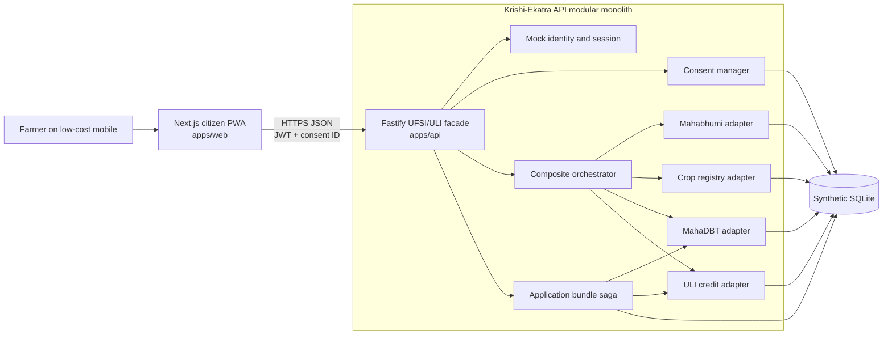
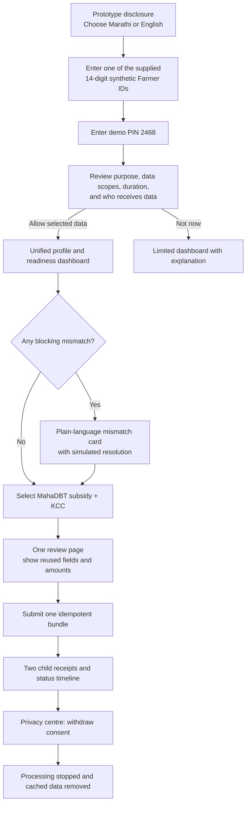
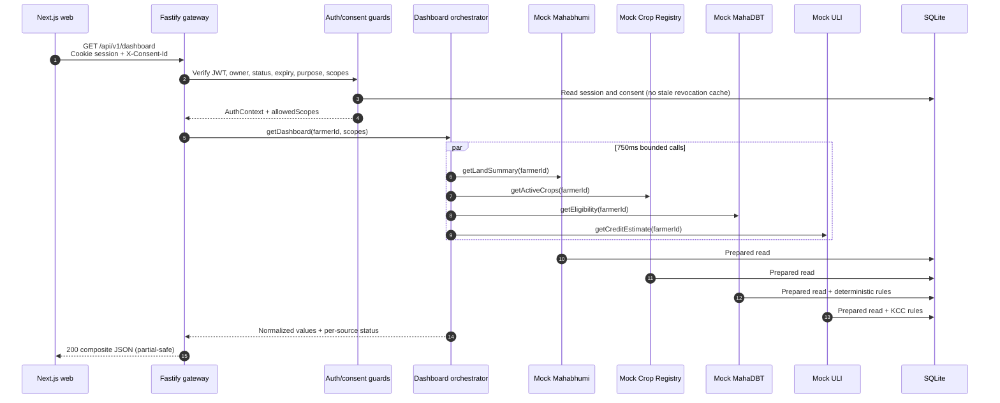
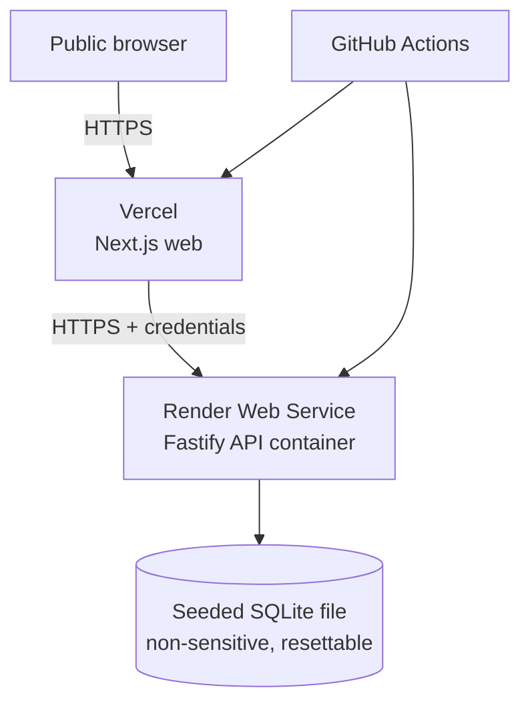

# Krishi-Ekatra: Definitive Full-Stack Architecture and Final Prototype Blueprint

> **Superseded structure notice:** KrishiSetu is the current product name. Use [KrishiSetu Modular Foundation Architecture](./KRISHISETU-MODULAR-FOUNDATION-ARCHITECTURE.md) for module boundaries, repository structure, single-source-of-truth rules, and localization. This document remains authoritative only for stack rationale, original end-to-end flow, deployment context, and quality targets that do not conflict with the newer architecture.

**Status:** Build-ready architecture baseline  
**Architecture date:** August 22, 2026  
**Internal feature freeze:** August 27, 2026  
**Official submission deadline:** August 28, 2026, 8:00 PM IST  
**Prototype boundary:** 100% synthetic identities, records, eligibility results, applications, banking responses, OTPs, and government-service behavior

## 1. Executive architecture decision

Krishi-Ekatra will be a **mobile-first citizen web application backed by a TypeScript modular monolith**. It will have two independently runnable apps in one npm workspace:

- `apps/web`: Next.js App Router renders the bilingual farmer journey.
- `apps/api`: Fastify provides the simulated UFSI/ULI gateway, consent enforcement, orchestration, rule evaluation, mock domain routes, persistence, and audit events.

The mock government and financial systems are **logical modules, not separately deployed microservices**. Each has a typed port and adapter, its own routes under `/mock`, and its own repository/service boundary. The composite gateway calls their adapters concurrently. This preserves the architectural seams needed to explain federation without creating five fragile deployments during a five-day hackathon.



### 1.1 What the prototype proves

The prototype proves the infrastructure and process improvement, not only a redesigned screen:

1. One synthetic 14-digit Farmer ID establishes a single mock identity.
2. One purpose-specific consent artefact authorizes named scopes for a limited duration.
3. One dashboard request is orchestrated across simulated land, crop, subsidy, and credit systems.
4. Joint land ownership is resolved through a Bucket ID and share allocation rather than a filename upload.
5. Eligibility and credit calculations are deterministic, explainable rules.
6. One idempotent bundle creates a MahaDBT subsidy application and a ULI/KCC pre-application together.
7. Domain-level failures become plain-language partial results and safe retries instead of an indefinite rejection.
8. Consent withdrawal stops future processing and purges consent-derived prototype data.

### 1.2 Explicit non-goals

- No connection to Aadhaar, NPCI, DigiLocker, AgriStack, UFSI, ULI, MahaBhulekh/Mahabhumi, MahaDBT, PM-KISAN, PMFBY, e-NAM, Kisan Rin, or any other live government/bank service.
- No real Aadhaar, PAN, bank account, mobile number, OTP, land record, caste certificate, or personal data.
- No claim of government approval, partnership, official status, or production readiness.
- No automated real-world welfare, lending, insurance, or legal eligibility decision.
- No multi-cloud, Kubernetes, Kafka, Redis, vector database, or production PKI for the hackathon build.

## 2. Tech stack decision

### 2.1 Exact build stack

Pin exact resolved versions in `package-lock.json`; use the listed compatible release lines when scaffolding.

| Layer | Selected technology | Why it is the best fit here |
|---|---|---|
| Runtime | Node.js 24 LTS | One runtime and language across web, API, scripts, and tests; current LTS baseline; fast team iteration. |
| Workspace | npm workspaces | Ships with Node, avoids another package manager/tool during a five-day sprint, and shares contracts/UI/config cleanly. |
| Frontend | Next.js 16.3 App Router + React 19.2 + TypeScript 5 | Production-quality routing, streaming/suspense, accessible server-rendered first paint, excellent deployment path, and fast iteration. |
| Styling | Tailwind CSS 4 + CSS custom properties | Encodes the civic tokens from the UI research while keeping responsive work fast and consistent. |
| Localization | `next-intl` + checked-in Marathi/English message JSON | Explicit bilingual content, formatting, and fallback behavior without runtime translation risk. |
| Forms | React Hook Form + shared TypeBox/JSON Schema-derived types | Low re-render overhead and clear error summaries on constrained devices. |
| Server state | TanStack Query 5 | Request cancellation, retry control, loading/error states, and cache invalidation after submit/revoke. |
| Icons/charts | Lucide React + lightweight SVG sparklines | Clear icons with text labels; avoids a heavy chart package for a two-minute demo. |
| API | Fastify 5 + TypeScript | Plugin boundaries, schema-first validation/serialization, fast startup, Pino logging, and automatic OpenAPI. |
| Contracts | TypeBox JSON Schemas + `@fastify/swagger` | One runtime schema drives validation, TypeScript types, examples, and the Swagger contract. |
| Auth/consent signing | `jose` | Signed mock JWT sessions and local ES256 consent artefacts using a dev-only keypair. |
| Database | SQLite 3 + `better-sqlite3` | Zero external database account, transactional writes, prepared statements, deterministic resets, and relational modeling of joint ownership. |
| Migrations | Ordered `.sql` files executed by a small migration runner | Transparent and inspectable; avoids ORM churn and keeps the Phase 2 schema recognizable. |
| Tests | Vitest, Fastify `inject`, Playwright, `axe-core` | Fast unit/contract coverage and a real end-to-end citizen-flow check. |
| Code quality | ESLint, Prettier, TypeScript strict mode | Familiar, low-risk quality gates. |
| Local environment | Docker Compose optional; native `npm run dev` default | Contributors can start quickly; containers reproduce the final API runtime. |
| Deployment | Vercel (`web`) + Render single service (`api`) | Public browser link, straightforward Next deployment, and a normal Node process able to use SQLite. |

### 2.2 Why Fastify/Node instead of Python/FastAPI or Express

- **Fastify over Express:** Fastify 5 requires full JSON Schema for request/response contracts, supplies structured logs, and supports isolated plugins. That is valuable for showing a credible gateway. Express would need more libraries and conventions to reach the same contract discipline.
- **Node over Python:** the team gets one type system and can share domain contracts, identifiers, money/date rules, error codes, and bilingual message keys between UI and API. Python/FastAPI is excellent, but a second language adds handoff and contract drift risk without improving this prototype's dominant workload.
- **Modular monolith over microservices:** deployment and debugging stay simple, but interfaces remain swappable. A production evolution can replace `MockMahabhumiAdapter` with a sanctioned UFSI client without rewriting orchestration or the UI.
- **SQLite over JSON Server:** relational joins, ownership shares, transactions, uniqueness, idempotency, and purge behavior are central to the story. JSON Server cannot credibly demonstrate them.
- **SQLite over hosted Postgres:** no external database dependency is needed for a deterministic demo. Postgres is the documented production evolution, not the hackathon dependency.

### 2.3 Meaningful OpenAI and Codex role

OpenAI is used in the **build pipeline**, not to make entitlement or credit decisions at runtime.

| Workflow | OpenAI/Codex contribution | Safety/verification |
|---|---|---|
| Architecture and scaffolding | Codex converts the research blueprints into typed modules, migrations, route stubs, and tests. | Human review; build/lint/test gates. |
| Synthetic AgriStack fixtures | `tools/synthetic-data-generator` calls the OpenAI Responses API with Structured Outputs to generate fictional Maharashtra personas, joint-owner spelling variants, crops, NPCI-like error scenarios, and application histories. | Prompt forbids real PII; schema validation; allowlisted villages/crops; deterministic post-processing; committed fixture manifest. |
| Bilingual microcopy | The generator drafts simple Marathi/English explanations for opaque codes and consent purposes. | Native-language review; checked-in copy; no live generation in the citizen flow. |
| Contract and failure tests | Codex generates boundary cases from OpenAPI: expired consent, missing scope, one mock node timeout, duplicated submit, joint ownership, and revocation. | Tests must fail before implementation and pass after; reviewers inspect expected outputs. |
| Documentation/demo | Codex helps produce API examples, architecture diagrams, and a two-minute demo checklist from tested behavior. | Examples are exercised in contract tests; mock disclosure remains explicit. |

Implementation rule:

```text
OPENAI_API_KEY exists only in a developer/CI secret store.
The browser never receives it.
The deployed citizen journey never requires an OpenAI call.
Only fictional, schema-bounded inputs are sent.
Generated fixtures are reviewed and committed with provenance.
Deterministic rule code—not a model—decides displayed mock eligibility and credit amounts.
```

The default generator model is configured as `OPENAI_SYNTH_MODEL=gpt-5-mini`, not hardcoded into domain logic. The fixture manifest records model name, prompt version, schema version, generation timestamp, reviewer, and SHA-256 of each accepted fixture file.

## 3. Repository and folder architecture

```text
krishi-ekatra/
├── apps/
│   ├── web/                              # Next.js citizen experience
│   │   ├── app/
│   │   │   ├── [locale]/
│   │   │   │   ├── (public)/
│   │   │   │   │   ├── page.tsx        # Prototype disclosure + start
│   │   │   │   │   └── login/page.tsx  # 14-digit Farmer ID + demo PIN
│   │   │   │   ├── (protected)/
│   │   │   │   │   ├── consent/page.tsx
│   │   │   │   │   ├── dashboard/page.tsx
│   │   │   │   │   ├── apply/page.tsx
│   │   │   │   │   ├── applications/page.tsx
│   │   │   │   │   └── privacy/page.tsx
│   │   │   │   ├── error.tsx
│   │   │   │   ├── loading.tsx
│   │   │   │   └── layout.tsx
│   │   │   ├── manifest.ts
│   │   │   ├── globals.css
│   │   │   └── layout.tsx
│   │   ├── components/
│   │   │   ├── auth/
│   │   │   ├── consent/
│   │   │   ├── dashboard/
│   │   │   ├── applications/
│   │   │   ├── feedback/
│   │   │   ├── navigation/
│   │   │   └── prototype-disclosure/
│   │   ├── hooks/
│   │   ├── lib/
│   │   │   ├── api-client.ts
│   │   │   ├── auth-session.ts
│   │   │   ├── format.ts
│   │   │   └── query-client.ts
│   │   ├── messages/
│   │   │   ├── en.json
│   │   │   └── mr.json
│   │   ├── public/
│   │   │   ├── fonts/
│   │   │   └── icons/
│   │   ├── tests/
│   │   │   ├── accessibility/
│   │   │   ├── components/
│   │   │   └── e2e/
│   │   ├── next.config.ts
│   │   └── package.json
│   └── api/                              # Fastify gateway + logical mock nodes
│       ├── src/
│       │   ├── server.ts                 # Listener only
│       │   ├── app.ts                    # Testable Fastify factory
│       │   ├── config/env.ts
│       │   ├── plugins/
│       │   │   ├── auth.ts
│       │   │   ├── consent-guard.ts
│       │   │   ├── database.ts
│       │   │   ├── error-handler.ts
│       │   │   ├── observability.ts
│       │   │   ├── openapi.ts
│       │   │   └── security.ts
│       │   ├── modules/
│       │   │   ├── identity/
│       │   │   ├── consent/
│       │   │   ├── composite-dashboard/
│       │   │   ├── application-bundle/
│       │   │   ├── mahabhumi/
│       │   │   ├── crop-registry/
│       │   │   ├── mahadbt/
│       │   │   ├── uli/
│       │   │   └── audit/
│       │   ├── infrastructure/
│       │   │   ├── sqlite/
│       │   │   ├── crypto/
│       │   │   ├── clock/
│       │   │   └── mock-network/
│       │   └── shared/
│       │       ├── errors.ts
│       │       ├── identifiers.ts
│       │       ├── money.ts
│       │       └── result.ts
│       ├── migrations/
│       │   ├── 001_core_registries.sql
│       │   ├── 002_consent_and_sessions.sql
│       │   ├── 003_applications.sql
│       │   └── 004_cache_and_audit.sql
│       ├── fixtures/
│       │   ├── farmers.json
│       │   ├── parcels.json
│       │   ├── crops.json
│       │   ├── schemes.json
│       │   ├── credit.json
│       │   ├── failure-scenarios.json
│       │   └── manifest.json
│       ├── tests/
│       │   ├── contract/
│       │   ├── integration/
│       │   ├── unit/
│       │   └── safety/no-live-gov-egress.test.ts
│       └── package.json
├── packages/
│   ├── contracts/                        # TypeBox schemas, inferred TS types, errors
│   ├── design-system/                    # Tokens and reusable accessible components
│   ├── eslint-config/
│   └── tsconfig/
├── tools/
│   ├── synthetic-data-generator/
│   │   ├── prompts/
│   │   ├── schemas/
│   │   ├── generate.ts
│   │   ├── validate.ts
│   │   └── README.md
│   ├── db/
│   │   ├── migrate.ts
│   │   ├── seed.ts
│   │   └── reset.ts
│   └── smoke/
│       └── citizen-journey.ts
├── docs/
│   ├── architecture/
│   ├── demo/
│   └── evidence/                         # screenshots, Lighthouse, test output
├── .env.example
├── .nvmrc                               # 24
├── docker-compose.yml
├── package.json
├── package-lock.json
└── README.md
```

### 3.1 Module rule

Each API domain module contains `*.route.ts`, `*.schema.ts`, `*.service.ts`, `*.repository.ts`, and `*.adapter.ts` as needed. Routes never issue SQL directly. Cross-domain calls go through ports defined in `packages/contracts` or module interfaces; no module imports another module's repository.

## 4. Final frontend architecture and UI design

### 4.1 Citizen journey



The primary two-minute demo follows the green path. Market, insurance, soil, and advisory capabilities remain visible as secondary cards only if the core path is stable.

### 4.2 Page and component hierarchy

```text
RootLayout
├── PrototypeDisclosureBanner (always visible; “Demo — not a government website”)
├── AccessibilityBar
│   ├── LanguageSwitch (मराठी / English)
│   ├── SunlightModeToggle
│   └── SkipToContentLink
├── PublicShell
│   ├── WelcomePage
│   └── LoginPage
│       └── FarmerIdLoginForm
└── ProtectedShell
    ├── MobileHeader
    ├── DesktopSideNavigation
    ├── MobileBottomNavigation
    └── MainContent
        ├── ConsentPage
        │   └── ConsentCard
        │       ├── PurposeSummary
        │       ├── ScopeChecklist
        │       ├── DataFlowSummary
        │       ├── DurationAndWithdrawal
        │       └── ConsentActions
        ├── DashboardPage
        │   ├── FarmerIdentityCard
        │   ├── ReadinessSummary
        │   ├── DataSourceStatusStrip
        │   ├── LandAndCropSummary
        │   ├── BankingStatusCard
        │   ├── RecommendedActions
        │   └── SchemeGrid
        │       ├── MahaDbtSchemeCard
        │       └── KccCreditCard
        ├── ApplyPage
        │   ├── SelectionSummary
        │   ├── ReusedDataSummary
        │   ├── EligibilityExplanation
        │   ├── ConsentScopeReminder
        │   └── BundleSubmitBar
        ├── ApplicationsPage
        │   ├── BundleReceipt
        │   ├── ChildApplicationCard
        │   └── PlainLanguageStepper
        └── PrivacyPage
            ├── ActiveConsentCard
            ├── DataStoredSummary
            ├── RevokeConsentDialog
            └── PurgeReceipt
```

### 4.3 Unified dashboard layout

Mobile is the reference viewport at 360×800 CSS pixels.

```text
┌──────────────────────────────────┐
│ DEMO • Not a government website │  persistent amber/black disclosure
├──────────────────────────────────┤
│ कृषी एकत्र        मराठी ▾  ☀︎    │  compact header; no logo wall
├──────────────────────────────────┤
│ नमस्कार, नामदेव                  │
│ Farmer ID ••••••••••0001  ✓     │
│ पाषाण, पुणे                      │
├──────────────────────────────────┤
│ तुमचा अर्ज तयार आहे              │  one dominant next-action card
│ जमीन ✓  पीक ✓  बँक ⚠            │
│ [तपशील पहा] [पुढे चला]          │
├──────────────────────────────────┤
│ एकत्र अर्ज करा                   │
│ ☑ ठिबक सिंचन — अंदाजे ₹48,000   │
│ ☑ KCC — पात्र मर्यादा ₹1,57,500 │
│ [दोन्ही अर्ज तपासा]              │
├──────────────────────────────────┤
│ माझी माहिती                      │  progressive disclosure
│ ▸ जमीन आणि संयुक्त मालकी        │
│ ▸ पीक नोंद                       │
│ ▸ बँक स्थिती                     │
├──────────────────────────────────┤
│ Home   Apply   Status   Privacy  │  56px bottom navigation
└──────────────────────────────────┘
```

Desktop uses a maximum 1200px content width with a 240px side navigation and a two-column card grid. It is an enhancement, not a separate information architecture.

### 4.4 Single login presentation

- The first screen identifies itself as a fictional hackathon demo before any input.
- There is one field: **14-digit Farmer ID**. It accepts digits only, groups them `27 2026 0000 0001`, and preserves the underlying value as a string.
- Three synthetic demo IDs are shown as tappable examples; users never enter a real mobile number or Aadhaar.
- The second step uses the fixed demo PIN `2468`, labelled “Demo PIN—no OTP is sent.”
- Validation is inline and repeated in an error summary. It never says “invalid beneficiary”; it says “This demo Farmer ID is not in the sample records. Use one of the IDs shown below.”
- The API returns a short-lived signed mock JWT in a Secure, HttpOnly, SameSite=Lax cookie. The UI never stores tokens in local storage.

### 4.5 Consent manager presentation

The consent page uses one plain-language card, not a legal-text modal over the dashboard.

It answers five questions before the Allow button:

1. **Why:** “To show your land, check scheme eligibility, and estimate a KCC limit.”
2. **What:** separate checked scopes for identity, land ownership/share, current crops, subsidy history, and masked bank/credit status.
3. **Who:** “Krishi-Ekatra demo gateway and the named mock services shown below.”
4. **How long:** 30 minutes or until the user withdraws consent.
5. **Control:** “You can continue without sharing, or withdraw later from Privacy.”

Controls:

- unchecked optional scopes are genuinely omitted from the downstream call;
- `Allow selected data` is the primary button;
- `Not now` remains a visible secondary button;
- a short expandable “Technical details” region shows consent ID, purpose code, timestamps, and mock signature status;
- consent is never bundled into login or pre-checked silently.

### 4.6 Scheme and credit cards

Every action card uses the same hierarchy:

1. citizen outcome: “Drip irrigation support” / “KCC crop loan estimate”;
2. mock eligibility badge: `Likely eligible`, `Needs one correction`, or `Not enough data`;
3. farmer amount first, government/program amount second;
4. three reasons using already fetched data;
5. a visible `Mock result` label;
6. checkbox to add to one application bundle;
7. `How was this calculated?` disclosure with deterministic rule inputs.

The interface never claims an application is approved. The final states are “Submitted to simulated MahaDBT” and “Pre-application accepted by simulated ULI.”

### 4.7 Civic design rules

- Use one primary task per screen and reveal record-level detail in accordions.
- Marathi is the first-run default; English remains one tap away. Never mix untranslated administrative codes into the main sentence.
- Use plain action statements: “Your bank account type is not accepted in this demo” instead of `ERR_NPCI_ACCOUNT_TYPE`.
- Keep code in a copyable detail row for support: `Technical code: MOCK-NPCI-014`.
- Body text is at least 16px, line height at least 1.6 for Devanagari, and form controls at least 56px high.
- Use Noto Sans Devanagari and a system Latin stack; subset/self-host fonts to avoid third-party font calls.
- Meet WCAG 2.2 AA; use AAA contrast for primary text where practical. Do not claim full AAA without a complete audit.
- Never communicate state by color alone. Pair color with icon, label, and `aria-live` behavior.
- Support 200% zoom, keyboard use, visible focus, reduced motion, and a 360px viewport without horizontal scrolling.
- Keep the initial route under a 200KB compressed JavaScript target where feasible; lazy-load nonessential maps/charts.
- Do not use government emblems or official logos. Use an original wordmark and the persistent prototype banner.

### 4.8 Loading, partial failure, and offline behavior

- Render the identity shell and skeleton cards immediately; the dashboard API has one loading region per domain.
- The API returns `sourceStatus` for each domain. A failed ULI card says “Credit estimate is temporarily unavailable; your land and subsidy information is still ready.”
- Manual retry targets only the failed domain through `POST /dashboard/refresh` with a domain list.
- TanStack Query may show the most recent in-memory dashboard for navigation, visibly timestamped. Sensitive dashboard JSON is not persisted to localStorage/IndexedDB.
- If offline before submit, preserve only the selected scheme codes and current route in session memory. Do not queue a financial application silently.

## 5. Final backend architecture and DPI integration

### 5.1 API responsibility map

| Module | Responsibility | Production-shaped counterpart |
|---|---|---|
| Identity | Validate allowlisted synthetic Farmer ID and demo PIN; issue session | Farmer Registry authentication/federated identity |
| Consent | Create, verify, expire, and revoke purpose/scope artefacts | DEPA-style consent manager |
| Composite dashboard | Orchestrate parallel source calls and normalize partial results | UFSI consumer-facing gateway |
| Mahabhumi | Return parcels, 7/12 summary, ULPIN, joint ownership Bucket ID/share | Land registry provider |
| Crop registry | Return season/crop/area survey snapshot | Crop Sown Registry/e-Pik adapter |
| MahaDBT | Explain deterministic subsidy eligibility and accept mock application | Scheme delivery provider |
| ULI | Calculate deterministic KCC estimate and accept mock pre-application | ULI lender/loan service provider |
| Application bundle | Idempotent parent/child workflow and retryable dispatch | Process orchestration layer |
| Audit | Correlation IDs, consent access events, state transitions, purge receipt | DPI observability/audit trail |

### 5.2 Gateway request lifecycle



The complete JSON and routes are specified in [API Contract and DPI Data Flows](./API-CONTRACT-AND-DATA-FLOWS.md).

### 5.3 Parallel fan-out/fan-in policy

- Resolve the authenticated farmer ID from the session; never trust a farmer ID query parameter for private routes.
- Verify consent before dispatch. Pass the minimum scopes to each adapter.
- Start Mahabhumi, Crop Registry, MahaDBT, and ULI calls concurrently.
- Give each adapter a 750ms timeout using `AbortSignal.timeout`; dashboard total budget is 1,200ms in the mock environment.
- Use `Promise.allSettled`, not `Promise.all`, so one domain cannot blank the entire dashboard.
- Normalize domain data at the boundary. Frontend code never depends on a mock provider's raw status names.
- Return HTTP 200 for a valid partial dashboard with `overallStatus: "PARTIAL"`; return 401/403 only for authentication/consent, and 503 only when no useful domain succeeded.
- Add a correlation ID to the response, logs, bundle, and every child call.
- Support deterministic failure injection only in development/demo fixtures, never via an undocumented public query parameter.

### 5.4 Joint ownership and identity mismatch

- `farmer_id`, `ulpin`, and all bank/land identifiers are stored as `TEXT`, never numeric types, to preserve leading zeros and avoid JavaScript precision errors.
- `parcel_holder_links` maps an individual synthetic Farmer ID to a parcel and a `bucket_id` representing the co-owner group.
- Eligibility uses `allocated_cultivable_hectares`, derived from verified share numerator/denominator, rather than the entire parcel area.
- A `name_match` record stores source values, normalized transliteration, confidence band, and a human-readable resolution status. It does not silently rewrite source records.
- A mismatch scenario can be resolved through a clearly labelled mock correction action that changes only the local synthetic record and emits an audit event.

### 5.5 Deterministic eligibility and KCC rules

Rule outputs include `ruleVersion`, inputs, outcome, and localized reason keys. Money is integer paise in TypeScript and integer rupees in SQLite fixtures; floating-point arithmetic is forbidden for financial amounts.

Prototype KCC estimate:

```text
baseCropCost = Σ(verified allocated acres × mock DLTC rate per acre)
householdAndPostHarvest = 10% of baseCropCost
assetMaintenance = 20% of baseCropCost
year1Estimate = baseCropCost + both provisions
mockMissEligibleAmount = min(year1Estimate, configured demo cap)
```

Rates and caps are labelled **illustrative mock values**, versioned in fixtures, and not presented as current RBI/NABARD advice. No model is in the calculation path.

### 5.6 Simultaneous application bundle

`POST /api/v1/application-bundles` accepts selected offerings plus one idempotency key.

1. Validate session, consent purpose, required scopes, and current source snapshots.
2. Begin a SQLite immediate transaction.
3. Insert one parent `application_bundle` and two `child_applications` in `QUEUED` state.
4. Commit so a retry can retrieve the same bundle.
5. Dispatch MahaDBT and ULI mock submissions concurrently.
6. Record each child outcome independently with provider receipt and timestamp.
7. Set parent to `COMPLETED`, `PARTIAL`, or `FAILED_RETRYABLE`.
8. Return the same resource for duplicate requests with the same key and request hash. Reject key reuse with a different body as `409 IDEMPOTENCY_CONFLICT`.

This is a small saga, not a fake distributed transaction. If MahaDBT succeeds and ULI times out, the successful child remains submitted and only the ULI child is retried.

### 5.7 Database tables

Core registry tables:

- `farmers`
- `land_parcels`
- `ownership_buckets`
- `parcel_holder_links`
- `crop_sown_records`
- `bank_mapping_status`
- `scheme_catalog`
- `subsidy_eligibility_snapshots`
- `credit_rate_cards`
- `credit_estimate_snapshots`

Process/privacy tables:

- `sessions`
- `consent_artefacts`
- `consent_access_events`
- `derived_dashboard_cache`
- `application_bundles`
- `child_applications`
- `application_events`
- `idempotency_records`
- `purge_jobs`
- `audit_tombstones`

Every mutable table has `created_at`, `updated_at`, and where applicable `version`. Foreign keys are enabled. State fields use CHECK constraints. Composite indexes cover `farmer_id + status`, `consent_id + status`, and `bundle_id + domain`.

### 5.8 DPDPA-oriented revocation and purge

The prototype implements data minimization and immediate consent withdrawal behavior without overstating legal or cryptographic guarantees.

On `DELETE /api/v1/consents/{consentId}`:

1. Authenticate the consent owner.
2. In one transaction change consent from `GRANTED` to `REVOKED`, write `revoked_at`, and invalidate all sessions authorized only through that consent.
3. Reject every new request using that consent before any adapter call.
4. Delete consent-derived dashboard caches, temporary normalized land/crop snapshots, draft bundle payloads, and unsubmitted attachments.
5. For this all-synthetic prototype, delete incomplete child applications; pseudonymize completed demo receipts if they must remain visible for judging.
6. Remove client query cache and cookie through the response; the Privacy page clears in-memory state.
7. Retain only a minimal audit tombstone: purge job ID, consent ID, timestamp, category counts, status, and receipt digest. Do not retain the farmer profile or payload.
8. Return a purge receipt. Its digest proves receipt integrity, **not the physical deletion of every storage bit**.

The immutable seed fixtures remain because they are fictional source-system data, not user-provided personal data. The UI explains this distinction: consent withdrawal removes copies and stops processing; resetting the demo can recreate the fictional source profile.

### 5.9 Observability

- Pino JSON logs with `requestId`, `correlationId`, route, duration, result status, and mock-domain timings.
- Never log full Farmer IDs, tokens, consent JWS, names, parcel geometry, or bank fields. Log masked ID suffix and internal record counts.
- `GET /health/live` verifies process availability; `GET /health/ready` verifies migrations and a read-only database query.
- `GET /api/v1/debug/trace/{correlationId}` is development-only and returns sanitized fan-out timings for the architecture demo.
- Metrics for dashboard total latency, per-domain latency/outcome, consent failures, bundle child outcomes, duplicate submissions, and purge jobs.

## 6. Deployment architecture



Deployment controls:

- `web` knows only `NEXT_PUBLIC_API_BASE_URL`.
- API CORS allowlist contains the exact Vercel production origin and localhost development origin.
- Cookies use `Secure`, `HttpOnly`, `SameSite=None` for cross-site production deployment; CSRF protection requires an origin check plus a session-bound CSRF token for mutations. A same-site custom domain is preferred if available.
- API starts by applying migrations and idempotently seeding fixtures. Ephemeral storage reset is acceptable and disclosed.
- Runtime egress is disabled by application policy except required platform services. No government domain appears in runtime client configuration.
- `/docs` Swagger UI is disabled publicly or protected by a demo-only read token; sanitized `openapi.json` may be published as evidence.

## 7. Quality attributes and acceptance targets

| Attribute | Prototype target | Verification |
|---|---|---|
| End-to-end completion | Login through two child receipts without manual database edits | Playwright happy-path test |
| Partial resilience | Any one domain can fail while other cards render | Four parameterized integration tests |
| Idempotency | Ten repeated submits create one bundle and max one child per domain | API concurrency test |
| Consent enforcement | Missing, expired, revoked, wrong owner, or insufficient scope never calls adapters | Spy-based integration tests |
| Purge | All consent-derived rows removed/pseudonymized per policy in one job | Database integration test |
| Accessibility | No serious/critical axe issues on six main screens; keyboard completion | axe + manual checklist |
| Mobile | No horizontal overflow at 360px; primary actions ≥48px, normally 56px | Playwright viewport assertions |
| Performance | Dashboard mock p95 <1.2s; first public screen LCP target <2.5s on throttled mobile | API benchmark + Lighthouse |
| Safety | No real identifiers in fixtures; no live government hosts in code/config | fixture scanner + egress test |
| Honesty | Every screen and receipt states “Prototype / mock data” | UI snapshot test |

## 8. Environment variables

```dotenv
# apps/web
NEXT_PUBLIC_API_BASE_URL=http://localhost:4000
NEXT_PUBLIC_PROTOTYPE_MODE=true

# apps/api
NODE_ENV=development
PORT=4000
WEB_ORIGIN=http://localhost:3000
SQLITE_PATH=./var/krishi-ekatra.db
SESSION_SIGNING_SECRET=replace-with-at-least-32-random-bytes
CONSENT_PRIVATE_JWK_JSON={"kty":"EC","crv":"P-256","...":"dev-only"}
CONSENT_PUBLIC_JWK_JSON={"kty":"EC","crv":"P-256","...":"dev-only"}
MOCK_CLOCK_ISO=2026-08-22T09:00:00+05:30
MOCK_FAILURE_PROFILE=none
LOG_LEVEL=info

# local/CI generator only; never configured in apps/web
OPENAI_API_KEY=
OPENAI_SYNTH_MODEL=gpt-5-mini
SYNTH_PROMPT_VERSION=1
```

`.env.example` contains placeholders only. Deployment secrets are never committed. The demo clock can be fixed for repeatable deadlines/statuses and is visibly labelled “Demo date.”

## 9. Build, run, test, and reset commands

```bash
npm ci
npm run db:migrate
npm run db:seed
npm run dev

npm run lint
npm run typecheck
npm run test
npm run test:contract
npm run test:e2e
npm run test:a11y
npm run build

npm run generate:fixtures    # optional, requires OPENAI_API_KEY
npm run validate:fixtures
npm run db:reset             # explicit demo reset; reseeds synthetic data
```

Root scripts use npm workspace commands. `db:reset` refuses to run when `PROTOTYPE_MODE` is not `true` and only targets the configured database file after checking its schema marker.

## 10. Final scope priority

### Must ship by August 27

- Persistent mock/prototype disclosure.
- Synthetic Farmer ID login and session.
- Granular consent grant/deny/expire/revoke.
- Composite dashboard with land, crop, bank readiness, MahaDBT, and ULI data.
- Joint ownership Bucket ID scenario.
- Deterministic subsidy and KCC explanations.
- One idempotent two-service application bundle.
- Status receipt with partial retry.
- Revocation/purge receipt.
- Marathi/English main path, accessibility checks, public deployment, and two-minute demo.

### Ship only after the main path is green

- One NPCI-style account mismatch and local mock correction.
- Market price card and soil-health summary.
- Sunlight mode.
- Development-only trace visualization.

### Explicitly defer

- Voice/Bhashini, maps/cadastral tiles, camera uploads, PMFBY claim capture, offline application submission, real payments, live notifications, and any live DPI connector.

This prioritization preserves the project's strongest claim: a working, consented, cross-domain public-service process rather than a wide but shallow portal redesign.

## 11. Source basis

- Repository research: `Civic Tech UI/UX Design Orchestration & Master Blueprint.md`.
- Repository research: `DPI Backend Architecture & Mock API Specification.md`.
- Official hackathon [Builder brief](https://buildwhatmovesindia.com/brief), inspected August 22, 2026.
- [Next.js 16.3 release information](https://nextjs.org/blog).
- [Node.js release status](https://nodejs.org/en/about/previous-releases).
- [Fastify 5 documentation and LTS policy](https://fastify.dev/docs/latest/).
- [OpenAI Responses API documentation](https://platform.openai.com/docs/api-reference/responses).
