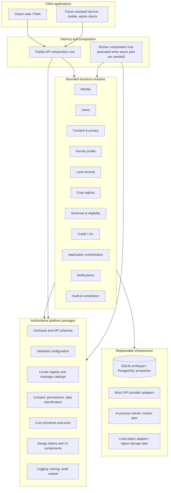
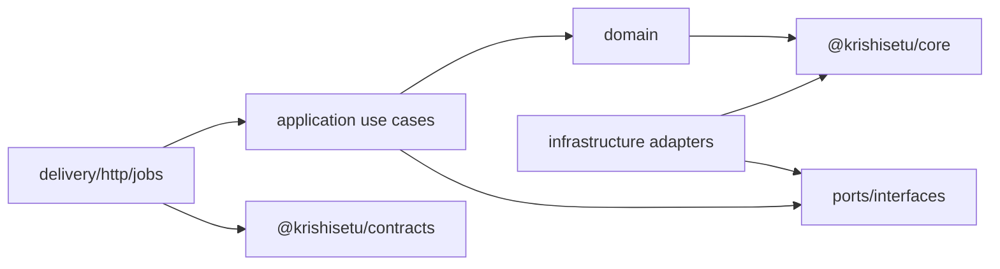
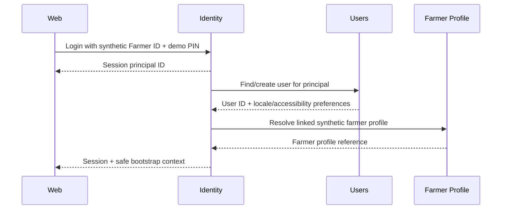

# KrishiSetu Modular Foundation Architecture

**Status:** Definitive implementation architecture  
**Supersedes:** the structural/folder guidance in `KRISHI-EKATRA-FULL-STACK-ARCHITECTURE.md`  
**Brand:** KrishiSetu  
**Architecture style:** domain-modular monolith with extraction-ready boundaries  
**Default locale:** English (`en`), resolved dynamically from the locale registry  
**Supported locales:** English (`en`), Marathi (`mr`), Hindi (`hi`), Kannada (`kn`)

## 1. Objective

KrishiSetu must be fast enough to build as a hackathon prototype and disciplined enough to grow into a real multi-domain public-service platform. The architecture therefore starts as a **modular monolith**, not a collection of premature microservices, but treats every business capability as a bounded module with explicit contracts, data ownership, ports, and events.

This approach minimizes future re-architecture. A module can later move into its own process or service by replacing its in-process adapter with an HTTP/event adapter; its domain rules, use cases, contracts, tests, and data ownership remain intact. No architecture can guarantee that all future requirements cause zero change, so the design promise is **stable boundaries and replaceable infrastructure**, not “never rewrite anything.”

## 2. Foundation principles

1. **Business capabilities are modules.** Identity, users, consent, land, crops, schemes, credit, applications, and audit are separate bounded contexts.
2. **One authoritative owner per fact.** A route, locale, token, policy, rule, or schema is defined once and imported or generated everywhere else.
3. **No business hardcoding.** Locale lists, scheme rules, consent scopes, status mappings, timeouts, limits, provider capabilities, and feature availability come from typed registries or versioned catalogs.
4. **The core is business-agnostic.** Shared primitives contain only genuinely universal concepts; `core` cannot become a miscellaneous `utils` folder.
5. **Dependencies point inward.** Delivery and infrastructure depend on application/domain code, never the reverse.
6. **A module owns its data.** Other modules cannot query or write its tables or import its repositories.
7. **Contracts precede implementations.** Public APIs, module ports, commands, events, and errors are typed and versioned.
8. **Composition happens at the edge.** The API composition root and dashboard orchestrator assemble modules; domain modules do not depend on the dashboard.
9. **Localization is a platform capability.** Modules emit stable message keys and locale-neutral values, not embedded English/Marathi sentences.
10. **Infrastructure is replaceable.** SQLite, an in-memory event bus, mock providers, local storage, and synchronous jobs are adapters behind ports.
11. **Security and consent are mandatory middleware and policy.** They are not optional helpers that feature teams may bypass.
12. **Observability is part of every use case.** Correlation, audit category, timings, and outcomes are standard execution context.

## 3. Target system shape



## 4. Module catalog

### 4.1 Platform and core modules

| Module/package | Owns | Must not own |
|---|---|---|
| `@krishisetu/core` | `Result`, `DomainError`, identifiers, `Money`, `Clock`, `IdGenerator`, pagination, transaction/event interfaces | farmer, subsidy, land, credit, or UI rules |
| `@krishisetu/config` | validated runtime/product/module configuration and feature flags | localized copy or design tokens |
| `@krishisetu/contracts` | API schemas, module commands/queries/events, error codes, generated OpenAPI types | service implementations |
| `@krishisetu/i18n` | locale registry, fallback rules, message catalogs, formatters, translation validation | business decisions |
| `@krishisetu/policy` | consent purposes/scopes, permissions, data classification, retention categories | session implementation or route handlers |
| `@krishisetu/design-tokens` | canonical JSON design tokens and generated CSS/Tailwind mappings | React behavior |
| `@krishisetu/design-system` | accessible visual components using generated tokens and i18n hooks | domain data access |
| `@krishisetu/observability` | request context, structured logging, tracing, redaction, metrics ports | business statuses |
| `@krishisetu/testing` | fixture builders, contract harnesses, accessibility helpers | production code paths |

### 4.2 Business modules

| Module | Primary aggregate/use cases | Own data |
|---|---|---|
| `identity` | mock login, session lifecycle, credentials, token issue/revoke | sessions, login attempts, credentials |
| `users` | user record, locale/accessibility preferences, notification preferences | users, user_preferences |
| `consent` | grant, validate, expire, revoke, purge request | consent artefacts/access events/purge jobs |
| `farmer-profile` | normalized farmer identity and registry linkage | farmer profiles/source links/name-match cases |
| `land-records` | parcels, ULPIN, joint ownership Bucket IDs and shares | parcels/ownership buckets/holder links |
| `crop-registry` | seasons, crop-sown records, areas and source verification | crop surveys/crop allocations |
| `schemes` | scheme catalog, eligibility rules, explanations, mock MahaDBT submissions | schemes/rule versions/eligibility snapshots/subsidy applications |
| `credit` | rate-card catalog, KCC estimates, readiness, mock ULI submissions | rate cards/credit estimates/pre-applications |
| `applications` | idempotent multi-domain bundle, child workflow, retries | bundles/children/idempotency/application events |
| `notifications` | localized notification intents and delivery preferences | notification jobs/delivery outcomes |
| `audit` | immutable sanitized audit facts and evidence exports | audit events/tombstones/export jobs |
| `dashboard` | read-only composition of module queries; no domain persistence | optional short-lived composition cache only |

### 4.3 Module internal structure

Every business module follows the same architecture:

```text
modules/<module>/
├── package.json
├── src/
│   ├── domain/                   # entities, value objects, domain services/events
│   ├── application/              # commands, queries, use cases, DTO mapping
│   ├── ports/                    # repository/provider/event/clock interfaces
│   ├── adapters/
│   │   ├── persistence/          # SQLite/PostgreSQL implementations
│   │   ├── providers/            # mock now; sanctioned DPI adapter later
│   │   └── messaging/            # in-process/outbox/broker adapters
│   ├── delivery/
│   │   ├── http/                 # Fastify route plugin + schemas
│   │   └── jobs/                 # worker entry adapters
│   ├── config/                   # schema/defaults owned by this module
│   ├── migrations/               # tables owned only by this module
│   ├── seed/                     # synthetic fixtures for this module
│   ├── index.ts                  # public application API only
│   └── composition.ts            # module factory/wiring
└── tests/
    ├── unit/
    ├── integration/
    ├── contract/
    └── architecture/
```

Only `index.ts` and explicitly exported contract types are public. Deep imports such as `@krishisetu/land-records/src/adapters/persistence/...` are forbidden by package `exports`, ESLint boundaries, and architecture tests.

## 5. Dependency rules



Allowed:

- `apps/api` imports module composition factories and delivery plugins.
- module application layers import their own domain and ports.
- adapters implement their module’s ports.
- the dashboard/application orchestrators call other modules through their public application APIs or integration contracts.

Forbidden:

- one module importing another module’s repository, migration, entity internals, or table;
- domain code importing Fastify, React, SQLite, environment variables, OpenAI SDK, or provider clients;
- shared packages importing business modules;
- modules importing `apps/*`;
- frontend feature code issuing provider/mock requests directly;
- a generic `utils.ts` containing unrelated behavior.

CI uses dependency-cruiser or an equivalent architecture test to enforce these rules.

## 6. Single-source-of-truth architecture

“Single source of truth” does not mean one giant configuration file. It means every concern has exactly one authoritative owner and all other representations are generated or imported.

| Concern | Authoritative source | Generated/consumed outputs | Forbidden duplicate |
|---|---|---|---|
| Product identity | `packages/config/src/product.config.ts` | header metadata, manifest, page title, API info | product names/motto repeated in components |
| Supported/default locales | `packages/i18n/src/locale-registry.ts` | Next routing, language selector, API validation, user preferences | locale arrays or default `en` scattered in apps |
| Message keys/text | `packages/i18n/messages/<locale>/*.json`; English keyset is canonical | typed message-key union, runtime bundles, copy QA report | literal user-facing text in modules/routes |
| API contract | TypeBox/OpenAPI schemas in `packages/contracts` | server validation, client SDK/types, examples, tests | separately handwritten frontend response types |
| Design tokens | `packages/design-tokens/tokens/*.json` | CSS variables, Tailwind theme, Storybook/Figma export | component-level hex codes/spacing values |
| Consent purposes/scopes | `packages/policy/src/consent-catalog.ts` | guards, consent UI, OpenAPI enums, tests | route-local scope arrays |
| Error catalog | `packages/contracts/src/errors/error-catalog.ts` | API codes, message keys, retry rules, UI mapping | provider strings or ad-hoc error objects |
| Routes | module route definitions + generated OpenAPI | API registration and typed client | manually duplicated URL constants |
| Domain rules | versioned catalog inside owning module | evaluations and explanation facts | rule values in UI/API handlers |
| Database shape | module-owned ordered migrations | database + generated schema documentation | cross-module table creation |
| Module availability | `packages/config/src/module-registry.ts` | route registration, navigation, feature exposure | hardcoded feature menus |
| Runtime environment | `packages/config/src/env.schema.ts` | validated immutable runtime config | direct `process.env` access outside config package |

### 6.1 Required enforcement

- ESLint forbids raw hex colours outside `design-tokens`, user-facing string literals in feature rendering, and direct `process.env` access outside `config`.
- Contract generation runs before build; generated files contain a header and are never edited manually.
- Translation validation fails for missing/extra keys or illegal interpolation differences.
- A catalog duplication test detects repeated scheme/status/consent codes outside the owner.
- Architecture tests reject cross-module deep imports and SQL table references outside the owning module.
- Design-token validation checks contrast and allowed semantic mappings.

## 7. Definitive repository structure

```text
krishisetu/
├── apps/
│   ├── web/                              # Next.js citizen frontend composition
│   │   ├── app/[locale]/                 # locale-aware route shells only
│   │   ├── src/
│   │   │   ├── features/                 # UI feature composition by business module
│   │   │   │   ├── identity/
│   │   │   │   ├── user-preferences/
│   │   │   │   ├── consent/
│   │   │   │   ├── dashboard/
│   │   │   │   ├── land-records/
│   │   │   │   ├── crop-registry/
│   │   │   │   ├── schemes/
│   │   │   │   ├── credit/
│   │   │   │   └── applications/
│   │   │   ├── composition/              # providers, navigation, module registry
│   │   │   └── generated/                # typed API client; never hand edit
│   │   ├── public/fonts/                  # self-hosted Noto family subsets
│   │   └── tests/
│   ├── api/                               # Fastify HTTP composition root
│   │   ├── src/app.ts
│   │   ├── src/server.ts
│   │   ├── src/composition/
│   │   └── tests/smoke/
│   └── worker/                            # present as a shell; activated for jobs/outbox
│       ├── src/composition/
│       └── src/worker.ts
├── modules/
│   ├── identity/
│   ├── users/
│   ├── consent/
│   ├── farmer-profile/
│   ├── land-records/
│   ├── crop-registry/
│   ├── schemes/
│   ├── credit/
│   ├── applications/
│   ├── notifications/
│   ├── audit/
│   └── dashboard/
├── packages/
│   ├── core/
│   ├── config/
│   ├── contracts/
│   ├── i18n/
│   │   ├── src/locale-registry.ts
│   │   ├── src/resolve-locale.ts
│   │   ├── messages/en/
│   │   ├── messages/mr/
│   │   ├── messages/hi/
│   │   └── messages/kn/
│   ├── policy/
│   ├── design-tokens/
│   │   ├── tokens/
│   │   └── generated/
│   ├── design-system/
│   ├── observability/
│   ├── testing/
│   ├── eslint-config/
│   └── tsconfig/
├── tools/
│   ├── codegen/                           # OpenAPI client, message keys, tokens
│   ├── database/                          # aggregate migration/seed runner
│   ├── synthetic-data-generator/
│   ├── architecture-tests/
│   └── smoke/
├── docs/
│   ├── architecture/
│   ├── design-system/
│   ├── implementation/
│   └── evidence/
├── deployment/
│   ├── docker/
│   ├── compose/
│   └── environments/
├── package.json
├── package-lock.json
├── tsconfig.json
└── .env.example
```

The root workspace scripts call package-local scripts; apps never discover modules by scanning the filesystem at runtime. The typed module registry controls composition deterministically.

## 8. Configuration and module registry

### 8.1 Product configuration

```ts
// packages/config/src/product.config.ts
export const productConfig = {
  id: 'krishisetu',
  name: 'KrishiSetu',
  mottoKey: 'brand.motto',
  prototype: true,
  supportContactKey: 'support.contact',
} as const;
```

Components import `productConfig`; they do not type `KrishiSetu` or the motto repeatedly.

### 8.2 Module registry

```ts
// packages/config/src/module-registry.ts
export const moduleRegistry = {
  identity: { enabled: true, required: true },
  users: { enabled: true, required: true },
  consent: { enabled: true, required: true },
  farmerProfile: { enabled: true, required: true },
  landRecords: { enabled: true, requiredScopes: ['LAND_READ'] },
  cropRegistry: { enabled: true, requiredScopes: ['CROP_READ'] },
  schemes: { enabled: true, requiredScopes: ['SUBSIDY_ELIGIBILITY_READ'] },
  credit: { enabled: true, requiredScopes: ['CREDIT_READ'] },
  applications: { enabled: true, requiredScopes: ['SUBSIDY_APPLY', 'CREDIT_PREAPPLY'] },
  notifications: { enabled: false },
} as const satisfies ModuleRegistry;
```

Environment overlays may disable optional modules, but cannot disable required identity/consent/safety modules. Configuration is validated once during composition and passed to modules as immutable values.

## 9. Internationalization and dynamic language architecture

### 9.1 Locale registry—the only locale source

```ts
// packages/i18n/src/locale-registry.ts
export const localeRegistry = {
  defaultLocale: 'en',
  supported: {
    en: { label: 'English', nativeLabel: 'English', direction: 'ltr', font: 'latin' },
    mr: { label: 'Marathi', nativeLabel: 'मराठी', direction: 'ltr', font: 'devanagari' },
    hi: { label: 'Hindi', nativeLabel: 'हिन्दी', direction: 'ltr', font: 'devanagari' },
    kn: { label: 'Kannada', nativeLabel: 'ಕನ್ನಡ', direction: 'ltr', font: 'kannada' },
  },
  fallbackLocale: 'en',
} as const;

export type Locale = keyof typeof localeRegistry.supported;
```

`DEFAULT_LOCALE` may override `defaultLocale` only after schema validation against `supported`. English remains the checked-in default; changing the deployment default requires one validated configuration change, not code edits across apps.

### 9.2 Locale resolution

Resolution is centralized in `@krishisetu/i18n`:

1. an explicit supported locale in the URL (`/[locale]/...`);
2. authenticated user preference from the `users` module;
3. signed locale cookie;
4. best supported match from `Accept-Language`;
5. configured default, initially `en`;
6. hard safety fallback from the registry, `en`.

The resolver returns `{ locale, source }` for observability. No route or component implements its own detection.

### 9.3 Message catalogs

```text
packages/i18n/messages/
├── en/brand.json, common.json, errors.json, consent.json, ...
├── mr/brand.json, common.json, errors.json, consent.json, ...
├── hi/brand.json, common.json, errors.json, consent.json, ...
└── kn/brand.json, common.json, errors.json, consent.json, ...
```

- English files define the canonical keyset, not the only copy source.
- All locales must contain the identical keys and interpolation variables.
- Feature modules refer only to keys such as `credit.status.sourceUnavailable`.
- APIs return stable `messageKey`, structured facts, and error codes; they do not return a hardcoded English sentence as the contract.
- Proper names and source-record text remain data. Scheme/crop/status names use codes resolved through catalogs.
- User choice persists with `PATCH /api/v1/users/me/preferences` and a signed cookie for anonymous users.
- Route generation, language switcher options, `<html lang>`, font selection, number/date/currency formatters, sitemap alternatives, and tests all consume the locale registry.

### 9.4 Fonts

| Locale | Font |
|---|---|
| `en` | Noto Sans |
| `mr`, `hi` | Noto Sans Devanagari |
| `kn` | Noto Sans Kannada |
| Sanskrit motto | Noto Sans Devanagari with `lang="sa-Deva"` |

Fonts are self-hosted, subset carefully, and use `font-display: swap`. Kannada cannot rely on the Devanagari font.

## 10. User and identity architecture

Identity and users are deliberately separate:

- **Identity** answers “Can this principal authenticate, and what session is active?”
- **Users** answers “Who is the platform user, and what preferences/accessibility settings should follow them?”
- **Farmer Profile** answers “What synthetic agricultural registry identity and provider links belong to the user?”



The session contains opaque `principalId` and `userId`; it does not embed the whole farmer profile or preference object. Each module authorizes its own operations using the standard execution context.

### 10.1 User preferences contract

```ts
type UserPreferences = {
  locale: Locale;
  highContrast: boolean;
  reducedMotion: boolean;
  textScale: 'default' | 'large';
  notificationChannels: Array<'in_app'>; // extensible later
};
```

Defaults come from the typed config/i18n registries. The `users` module validates and persists overrides.

## 11. API and contract architecture

- Public endpoints remain `/api/v1`; each module registers its plugin through the composition root.
- TypeBox schemas in `@krishisetu/contracts` generate OpenAPI and the frontend client.
- The generated client is the only web-layer HTTP access path.
- Requests carry `X-Request-Id`; composition creates `X-Correlation-Id`; mutations use CSRF and idempotency where relevant.
- Error responses contain `code`, `messageKey`, `facts`, `retryable`, and IDs. The client localizes the key.
- Contract changes are additive within `v1`; breaking changes require a new version or compatibility adapter.
- Provider contracts live behind module ports. Mock and sanctioned adapters must pass the same provider contract suite.

New core routes:

```text
GET   /api/v1/meta/locales
GET   /api/v1/meta/modules
GET   /api/v1/users/me
PATCH /api/v1/users/me/preferences
```

`/meta/locales` is generated from the locale registry and lets non-Next clients discover supported languages. It must not become a second locale source.

## 12. Data architecture and ownership

### 12.1 Prototype and production adapters

| Concern | Prototype | Production evolution |
|---|---|---|
| Relational data | SQLite, one file | PostgreSQL cluster, schema per module initially |
| Transactions | local transaction port | PostgreSQL transaction/unit of work |
| Events | in-process event dispatcher after commit | transactional outbox + broker |
| Jobs | synchronous/shell worker | durable queue + independent workers |
| Files | none/local mock metadata | object storage with malware scanning and retention |
| Providers | in-process mock adapters | sanctioned UFSI/ULI connectors |
| Cache | in-memory/derived SQLite cache | distributed cache only where justified |

### 12.2 Data rules

- Tables are prefixed or placed in a module schema and created only by that module’s migrations.
- Cross-module foreign keys are avoided. Store the other aggregate’s stable ID and verify through application contracts.
- Cross-module reads use queries/APIs, not joins. The dashboard builds a read model through module queries.
- Multi-module workflows use a saga/process manager. They do not attempt a distributed transaction.
- The prototype migration runner orders module migrations from the module registry and records module/version/checksum.
- Production read models may be populated by integration events without changing domain ownership.

## 13. Events and future service extraction

Modules publish versioned integration events only after their local transaction commits:

```ts
type IntegrationEvent<TType extends string, TPayload> = {
  id: string;
  type: TType;
  version: 1;
  occurredAt: string;
  correlationId: string;
  causationId?: string;
  producer: ModuleId;
  payload: TPayload;
};
```

Examples:

```text
user.preference.changed.v1
consent.granted.v1
consent.revoked.v1
land.holdings.refreshed.v1
scheme.eligibility.evaluated.v1
credit.estimate.created.v1
application.child.accepted.v1
application.bundle.completed.v1
```

The prototype event adapter dispatches in process and records an outbox-shaped audit row. A production broker adapter later changes transport, not use-case code. Events contain minimum necessary data and stable identifiers, not whole farmer records.

## 14. Common cross-cutting execution context

Every command/query receives the same typed context:

```ts
type ExecutionContext = {
  requestId: string;
  correlationId: string;
  principalId?: string;
  userId?: string;
  consentId?: string;
  locale: Locale;
  clock: Clock;
  permissions: ReadonlySet<Permission>;
  dataScopes: ReadonlySet<ConsentScope>;
};
```

This context is created once at the edge. Modules cannot read cookies, headers, global clocks, or environment variables directly.

## 15. Frontend module architecture

The Next app contains composition and feature presentation only:

```text
apps/web/src/features/<feature>/
├── components/               # feature-specific presentation
├── hooks/                    # typed client/query integration
├── mappers/                  # contract DTO to view model
├── routes/                   # page composition fragments
├── tests/
└── index.ts                  # public feature exports
```

Rules:

- shared accessible primitives come from `@krishisetu/design-system`;
- API DTOs come from the generated client;
- messages come from `@krishisetu/i18n`;
- navigation is generated from the module registry plus permissions/scopes;
- feature modules do not import each other’s internals;
- dashboard/review pages compose feature public exports;
- server state is TanStack Query; short-lived UI state stays local; no duplicate global store by default;
- no business eligibility or money calculation occurs in the browser.

## 16. Security and policy integration

- `@krishisetu/policy` owns consent scope/purpose definitions and data categories.
- The API consent guard reads route metadata generated from the same catalog used by the consent UI.
- A missing, expired, revoked, wrong-owner, or insufficient consent stops before module/provider invocation.
- Log redaction rules are centralized in observability and tested against every contract schema classified as sensitive.
- Runtime egress policy denies government/bank hosts; mock adapters contain no network client.
- The State Emblem remains absent from prototype assets.
- Module architecture tests ensure no feature route bypasses standard auth/consent/error plugins.

## 17. Testing strategy

| Test | Purpose |
|---|---|
| Domain unit | deterministic rules, value objects, state transitions |
| Application unit | use-case orchestration with fake ports |
| Adapter integration | migrations, repositories, mock provider behavior |
| Module contract | public commands/queries/events and HTTP schemas |
| Architecture | dependency direction, table ownership, no deep imports/hardcoding |
| Locale completeness | identical keys/interpolations for `en`, `mr`, `hi`, `kn` |
| Design token | generated files current, no raw hex, contrast checks |
| Security/policy | consent guard before adapters, redaction, egress denial |
| End-to-end | English default plus language switching/persistence for all four locales |
| Accessibility | axe + manual keyboard/screen-reader/zoom across locales |

Every module must provide a test kit so the composition root can validate alternate adapters before a provider or database is replaced.

## 18. Evolution without domain rewrite

### Stage A — hackathon

- Next web + Fastify API modular monolith;
- SQLite adapters;
- in-process mock DPI adapters and events;
- synchronous bundle/purge for small synthetic data;
- English default, four checked-in locale catalogs.

### Stage B — production-shaped pilot

- PostgreSQL adapter and schema-per-module ownership;
- outbox and worker for application dispatch/purge/notifications;
- managed secrets/KMS and stronger identity integration;
- module-level metrics/SLOs;
- sanctioned sandbox provider adapters;
- admin/assisted-service app using the same contracts.

### Stage C — selective extraction

Extract a module only when trust boundary, independent scale, release ownership, or reliability justifies it:

1. deploy the module composition as a service;
2. replace the caller’s in-process application adapter with generated HTTP/event adapter;
3. move its owned tables through a controlled migration/replication cutover;
4. preserve commands, queries, event versions, error catalog, policies, and tests;
5. leave other modules in the monolith.

This is not a mandatory microservice roadmap. The modular monolith may remain the best production topology for many modules.

## 19. Architecture governance and definition of done

A feature is not complete until:

- it belongs to one named module;
- public command/query/event contracts exist;
- business rules are versioned in the owning module, not copied;
- user-facing strings are message keys with `en`, `mr`, `hi`, and `kn` values;
- design uses generated tokens/components with no raw brand values;
- auth/consent/permissions are declared from policy catalogs;
- persistence uses the module repository port and owned migrations;
- structured audit/telemetry is emitted through shared context;
- domain, contract, architecture, locale, and relevant accessibility tests pass;
- mock/live boundary remains explicit and no live government API is introduced.

## 20. Architecture source hierarchy

When implementation sources conflict, use this order:

1. This document for module boundaries, repository shape, SSOT, localization, and evolution.
2. `SECURITY-PRIVACY-AND-THREAT-MODEL.md` for safety/privacy constraints.
3. `API-CONTRACT-AND-DATA-FLOWS.md` plus its localization amendment for external behavior.
4. `KRISHISETU-BRAND-AND-UI-DESIGN-SYSTEM.md` and generated design tokens for visuals/accessibility.
5. `DPI Backend Architecture & Mock API Specification.md` for research/schema/routing input.
6. `Civic Tech UI/UX Design Orchestration & Master Blueprint.md` for audit evidence, user friction, and initial interaction concepts.
7. The older `KRISHI-EKATRA-FULL-STACK-ARCHITECTURE.md` for stack/deployment context not superseded here.

The phase-based implementation authority is `docs/implementation/KRISHISETU-FINAL-IMPLEMENTATION-PLAN.md`.

