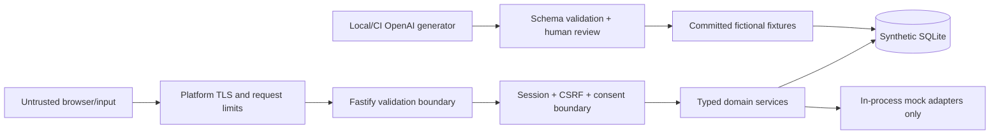

# Krishi-Ekatra Security, Privacy, and Mock-Data Boundary

## 1. Safety statement

Krishi-Ekatra is a fictional, non-official hackathon prototype. It must not receive or retrieve real personal data. Every identity, account, land parcel, crop, consent, eligibility outcome, credit estimate, application, and receipt is synthetic.

This document treats DPDPA/DEPA-inspired behavior as a product architecture pattern. It is not a legal compliance certification and does not claim the prototype implements an official consent-manager specification.

## 2. Non-negotiable controls

1. Never call, probe, scrape, reverse-engineer, or test a live government, bank, Aadhaar, NPCI, or public-service API.
2. Never collect a real Aadhaar/PAN, phone number, OTP, password, bank account, IFSC, land extract, photo, or payment credential.
3. Do not include government emblems or logos and do not describe the site as official.
4. Show `Hackathon prototype • Not a government website • All records are fictional` on every route.
5. Provide only allowlisted synthetic Farmer IDs and one labelled demo PIN.
6. Runtime provider adapters must resolve only to in-process mock modules. There is no configurable live-provider URL.
7. The optional OpenAI fixture generator receives synthetic seeds only; its API key is never shipped to the browser or runtime citizen path.
8. Deterministic code owns eligibility/credit outputs; a model may draft fixtures and copy but may not decide outcomes at runtime.

## 3. Data classification

| Class | Examples | Storage | Logging |
|---|---|---|---|
| Public | design tokens, scheme descriptions, disclosure text | repository/CDN | permitted |
| Synthetic restricted | fictional names, Farmer IDs, parcels, crop and bank mock status | SQLite/fixtures | masked/minimized |
| Secret | session secret, consent private JWK, CSRF/session token, OpenAI key | deployment/developer secret store | never |
| Derived ephemeral | dashboard cache, normalized snapshots, draft bundle payload | SQLite with consent ID and expiry | counts/timings only |
| Minimal audit | request/correlation ID, state transition, timestamp, category counts | SQLite/log stream | permitted without payload |

Although fixtures are fictional, the app handles them as if sensitive so the demonstrated architecture is credible.

## 4. Trust boundaries



Untrusted inputs include route/body/header values, generated fixture drafts before acceptance, browser state, and provider error fixtures.

## 5. Threat model

| Threat | Risk in prototype | Controls | Verification |
|---|---|---|---|
| User enters a real identifier | Accidental collection | No Aadhaar/mobile fields; Farmer ID must match fixture allowlist; no free-form uploads | E2E negative tests and UI review |
| Live government call added accidentally | Violates brief and safety boundary | No provider base URL; mock adapters are imports; outbound host allowlist; repository scan for network calls and government domains | `no-live-gov-egress.test.ts` in CI |
| Broken object-level authorization | One demo persona sees another | Farmer ID comes from session; consent owner and bundle owner checked on every access | Cross-persona contract tests |
| Consent bypass | Data fetched without permission | Fastify pre-handler verifies status, owner, purpose, scope, expiry before adapter construction/invocation | Adapter spies assert zero calls |
| Consent revoked but cached data remains | Continued processing | No revocation cache; synchronous SQLite purge; browser query cache cleared; private responses `no-store` | Purge integration test |
| Duplicate simultaneous application | Multiple child submissions | Idempotency key + request hash + unique `(bundle_id, domain)` + transaction | Concurrent test |
| CSRF on mutations | Unwanted submit/revoke | Origin allowlist, SameSite cookie, session-bound CSRF token | API tests with missing/wrong origin/token |
| XSS/injected localized content | Token/action theft | React escaping, no raw HTML, CSP, validated English/Marathi/Hindi/Kannada catalogs, schema-bounded fixtures | CSP scan, unit tests |
| SQL injection | Data corruption/read | Prepared statements only; allowlisted sort/filter values; no dynamic SQL fragments | static review + malicious input tests |
| Secret/token leakage in logs | Credential reuse | Pino serializers/redaction; never log headers/body; masked identifier suffix only | log snapshot tests |
| Model hallucinates real-looking unsafe data | Inappropriate fixtures | Prompt constraints, JSON Schema, synthetic prefixes, allowlists, identifier scanners, human review | fixture validation job |
| Misleading approval/official claim | Citizen/judge deception | Persistent disclosure, `MOCK` statuses, original brand, no government logos | screenshot/UI text test |
| Provider timeout causes whole-page failure | Broken end-to-end journey | per-domain timeout, `allSettled`, partial response and retry | failure-profile tests |

## 6. Authentication and session controls

- Farmer ID is a 14-character digit string validated against `^\d{14}$`, then against the seeded allowlist.
- Demo PIN is fixed, disclosed, and never portrayed as an OTP. It is not a real authentication factor.
- Session JWT lifetime is 60 minutes maximum; consent lifetime is 30 minutes maximum.
- Session is in a Secure, HttpOnly cookie. No auth or consent token is stored in localStorage.
- Logout invalidates the session server-side and clears private TanStack Query data.
- Five failed login attempts trigger a short in-memory/IP rate limit. The copy states this is a demo safeguard.

## 7. Consent enforcement order

For every consent-protected route:

1. validate request schema and size;
2. validate session signature/expiry and read active session row;
3. derive farmer ID from session;
4. load consent by header ID;
5. compare consent owner to session owner using exact string comparison;
6. require `GRANTED`, `now < valid_until`, matching purpose, and all route scopes;
7. append a minimized consent access event;
8. only then invoke domain adapters.

An error at steps 1–6 must cause **zero provider adapter invocations**.

## 8. Revocation and retention policy

| Data | On consent withdrawal | Rationale |
|---|---|---|
| Consent record | Status/timestamps retained; payload/signature removed after receipt creation | Prevent reuse and support minimal audit |
| Session | Invalidated immediately | Stop access |
| Derived dashboard cache | Deleted | No continuing display/processing |
| Temporary normalized snapshots | Deleted | Purpose ended |
| Unsubmitted drafts/attachments | Deleted | Not needed |
| Incomplete demo applications | Deleted | Prototype has no independent retention basis |
| Completed demo receipts | Pseudonymized or deleted; counts may remain | Preserve demo audit without profile |
| Synthetic seed fixtures | Retained | Fictional mock source data; resettable and disclosed |
| Audit tombstone | Minimal consent ID, purge ID, time, counts, digest | Show operation without retaining payload |

The receipt digest protects receipt integrity only. Documentation and UI must not call it cryptographic proof that storage blocks were physically erased.

## 9. Fixture safety validator

`npm run validate:fixtures` fails when any fixture contains:

- a 12-digit Aadhaar-shaped value;
- a PAN-shaped value;
- a non-demo phone number or email;
- an unmasked bank account or production-looking payment credential;
- a URL with `.gov.in`, `.nic.in`, a bank domain, or an IP outside localhost;
- a Farmer ID outside the reserved synthetic range `27202600000001`–`27202600000099`;
- a record without `synthetic: true` and a `fixtureScenarioId`;
- a village/person combination copied from input research rather than generated allowlisted fixture material;
- generated content not matching the checked-in JSON Schema.

Accepted fixture files are hashed into `fixtures/manifest.json`. Regeneration creates a review diff; it never silently replaces committed data.

## 10. Runtime egress guard

The API has no HTTP clients inside provider adapters. If a future adapter imports `fetch`, `undici`, Axios, or a socket client, the safety test fails unless the destination is the explicit OpenAI build tool directory—which is not imported by `apps/api`.

CI checks:

```text
- reject gov.in/nic.in/provider URLs in executable code and environment templates
- reject network-client imports in `modules/*/src/adapters/providers/mock*`
- reject OPENAI_API_KEY references under apps/web
- verify mock routes require internal authentication
- build a dependency graph proving tools/synthetic-data-generator is absent from runtime bundles
```

## 11. Web/API security headers

- Content-Security-Policy with `default-src 'self'`, explicit API `connect-src`, no third-party fonts/scripts, and no `unsafe-eval` in production.
- `frame-ancestors 'none'`, `object-src 'none'`, `base-uri 'self'`, and strict `form-action`.
- HSTS from hosting platform, `X-Content-Type-Options: nosniff`, strict Referrer-Policy, and restrictive Permissions-Policy (camera/microphone/geolocation disabled for v1).
- Private API responses set `Cache-Control: no-store, private`.
- Request bodies are capped at 64KB; v1 has no file uploads.

## 12. Security release gate

The build cannot be tagged `demo-final` until:

- all safety tests and consent authorization tests pass;
- a clean seeded database contains only manifest-listed synthetic fixtures;
- deployment secrets are rotated from local defaults;
- public routes show the prototype disclosure at 360px and desktop widths;
- a reviewer completes the full journey without supplying personal information;
- network inspection shows no government, bank, analytics, or font calls;
- the OpenAI key is absent from browser bundles and deployed runtime environment unless the generator is deliberately run in isolated CI;
- the source and demo explicitly list what is mocked.
