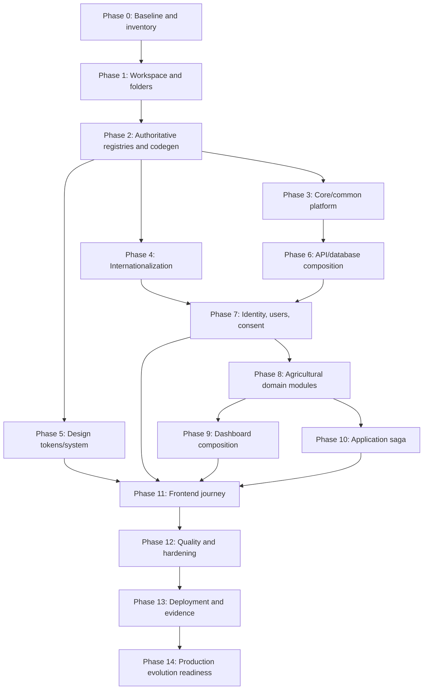

# KrishiSetu Final Implementation Plan

**Planning style:** dependency-ordered phases, not calendar dates  
**Architecture authority:** `docs/architecture/KRISHISETU-MODULAR-FOUNDATION-ARCHITECTURE.md`  
**Delivery rule:** complete and verify each phase’s exit gate before building dependent feature behavior

## 1. Purpose

This document converts all KrishiSetu research and architecture into an implementation sequence. It begins with folders, workspace tooling, authoritative registries, and common platform behavior; it then adds user/consent capabilities, business modules, orchestration, frontend journeys, and production-shaped adapters.

The phases are cumulative. A phase may be developed in parallel only when it has no unmet dependency and teams agree on the same contracts first.

## 2. Source documents and what to use them for

### 2.1 Source-of-truth matrix

| File | Implementation authority | Use during phases | Do not copy blindly |
|---|---|---|---|
| `docs/architecture/KRISHISETU-MODULAR-FOUNDATION-ARCHITECTURE.md` | definitive structural architecture | every phase | nothing may bypass its module/SSOT/dependency rules |
| `docs/architecture/API-CONTRACT-AND-DATA-FLOWS.md` | public behavior and JSON-flow baseline | contracts, gateway, applications, consent | bilingual hardcoded examples; use localization amendment |
| `docs/architecture/SECURITY-PRIVACY-AND-THREAT-MODEL.md` | safety, privacy, mock boundary | common platform and every feature | no live provider/API behavior |
| `docs/architecture/decisions/ADR-001-TYPESCRIPT-MODULAR-MONOLITH.md` | stack/topology decision record | workspace/platform/deployment | older folder layout superseded by modular foundation |
| `docs/design-system/KRISHISETU-BRAND-AND-UI-DESIGN-SYSTEM.md` | brand, header, UX4G/GIGW-aligned components/accessibility | design tokens, common UI, frontend phases | authorized State Emblem in prototype |
| `docs/design-system/krishisetu.tokens.css` | current reference CSS | token conversion/bootstrap | treat final generated CSS as derivative of token JSON |
| `DPI Backend Architecture & Mock API Specification.md` | Phase 2 backend research | data model, UFSI/ULI concepts, fan-out, KCC, purge, synthetic cases | old flat module layout, raw values, or claims superseded by current docs |
| `Civic Tech UI/UX Design Orchestration & Master Blueprint.md` | Phase 1 UX research | portal friction, progressive disclosure, mobile cards, plain-language patterns | earlier name, bilingual-only scope, old technology versions |
| `docs/architecture/KRISHI-EKATRA-FULL-STACK-ARCHITECTURE.md` | earlier full-stack baseline | stack rationale, deployment, quality attributes | folder structure/localization sections superseded by modular foundation |
| `docs/architecture/HACKATHON-EXECUTION-PLAN.md` | historical/date-oriented delivery plan | demo script, release gates, contingency cuts | date sequence and Marathi-first references |

### 2.2 Conflict resolution

When two files disagree:

1. security/privacy/mock restrictions win over feature convenience;
2. the modular foundation wins for structure, dependencies, SSOT, and languages;
3. API contract wins for externally observable behavior unless its localization amendment changes the representation;
4. design system wins for visual/accessibility behavior;
5. original research files explain intent and evidence but do not override current architecture.

Record unresolved decisions as ADRs before implementation. Do not resolve a conflict by hardcoding a local exception.

## 3. Phase dependency map



## 4. Phase 0 — Baseline, naming, and requirement inventory

### Objective

Establish the current documents, decisions, non-negotiable constraints, and brand name before generating code.

### Actions

- Treat `KrishiSetu` as the canonical citizen-facing name.
- Create an inventory of every current file and mark it `authoritative`, `supporting research`, `historical`, or `generated`.
- Record the current mock-only and no-real-Aadhaar boundary in root `README.md`.
- Record the four supported locale codes and English default without yet duplicating them in app code.
- Capture open questions as ADR candidates; do not block safe folder/bootstrap work.
- Define repository owners for architecture, contracts, copy/locales, tokens, and security review.

### Files to consult

- all files in the source-of-truth matrix;
- especially the modular foundation sections 1–2 and security document sections 1–2.

### Deliverables

```text
README.md
docs/decisions/decision-log.md
docs/source-register.md
```

### Exit gate

- one canonical product name in current documents;
- source hierarchy reviewed;
- no implementation assumes live providers, real identifiers, or official branding.

## 5. Phase 1 — Workspace, folders, and basic build

### Objective

Create the complete modular skeleton so later work lands in the correct owner from the first commit.

### Actions

- Initialize npm workspaces for `apps/*`, `modules/*`, and `packages/*`.
- Pin Node.js and dependency versions; commit `package-lock.json`.
- Create the definitive folder tree from the modular architecture document.
- Create package names and explicit `exports` maps.
- Add strict shared TypeScript, ESLint, Prettier, and test configurations.
- Add root scripts for build, lint, typecheck, unit, integration, contract, architecture, locale, accessibility, migration, seed, and code generation.
- Create minimal `apps/web`, `apps/api`, and dormant `apps/worker` composition roots.
- Create one empty package for every planned core/business module to avoid later folder churn.
- Configure path/package resolution through workspaces, not ad-hoc aliases into source internals.

### Initial folder creation checklist

```text
apps/web
apps/api
apps/worker
modules/{identity,users,consent,farmer-profile,land-records,crop-registry,schemes,credit,applications,notifications,audit,dashboard}
packages/{core,config,contracts,i18n,policy,design-tokens,design-system,observability,testing,eslint-config,tsconfig}
tools/{codegen,database,synthetic-data-generator,architecture-tests,smoke}
docs/{architecture,design-system,implementation,evidence}
deployment/{docker,compose,environments}
```

### Files to consult

- modular foundation sections 3–7;
- ADR-001 for runtime/framework rationale;
- older full-stack blueprint only for dependency/version baseline.

### Deliverables

- every workspace package builds an empty entry point;
- root build graph succeeds;
- no circular workspace dependencies;
- import-boundary rules are active.

### Exit gate

```bash
npm ci
npm run lint
npm run typecheck
npm run build
npm run test:architecture
```

All commands pass on a clean checkout.

## 6. Phase 2 — Authoritative registries and generation pipeline

### Objective

Implement the single-source-of-truth mechanism before feature code can duplicate values.

### Actions

1. Create `product.config.ts` with product ID/name, motto message key, prototype flag, and public metadata.
2. Create `module-registry.ts` with module IDs, required/optional status, feature flags, navigation capability, and consent requirements.
3. Create `locale-registry.ts` with `defaultLocale: 'en'` and `en`, `mr`, `hi`, `kn` definitions.
4. Create consent purpose/scope and permission catalogs in `@krishisetu/policy`.
5. Create the error catalog with error code, message key, retryability, safe fact schema, and HTTP mapping.
6. Create canonical JSON design-token files from the brand reference CSS.
7. Create TypeBox contract source folders and OpenAPI metadata.
8. Implement generators for:
   - CSS variables and Tailwind mappings from token JSON;
   - typed message-key unions from English catalog keys;
   - frontend API types/client from OpenAPI;
   - documentation tables from module/locale/policy registries.
9. Add generated-file headers and `codegen:check` that fails on drift.
10. Add lints/tests for raw hex values, direct environment access, user-facing string literals, duplicated codes, and forbidden deep imports.

### Files to consult

- modular foundation sections 6, 8, and 9;
- design system sections 2, 6, 7, and 8;
- API contract error and header conventions;
- security document data classification and consent rules.

### Deliverables

```text
packages/config/src/product.config.ts
packages/config/src/module-registry.ts
packages/config/src/env.schema.ts
packages/i18n/src/locale-registry.ts
packages/policy/src/{consent-catalog,permission-catalog,data-classification}.ts
packages/contracts/src/errors/error-catalog.ts
packages/design-tokens/tokens/*.json
tools/codegen/*
```

### Exit gate

- changing one design token updates generated CSS;
- adding one locale registry item updates route/language-selector types;
- adding one message key causes missing translations to fail;
- generated outputs are clean after `npm run codegen && npm run codegen:check`;
- feature packages cannot compile if they import environment variables or raw internal paths.

## 7. Phase 3 — Core utilities and common platform implementation

### Objective

Build the reusable kernel and cross-cutting behavior once, without placing domain logic into common code.

### `@krishisetu/core`

Implement and test:

- branded identifiers and safe parsing;
- `Result<T, DomainError>` and error metadata;
- `Money` using integer paise;
- `Clock` and fixed/system adapters;
- `IdGenerator` and deterministic/test adapters;
- pagination/cursor primitives;
- transaction/unit-of-work port;
- domain/integration event envelope and event-publisher port;
- `ExecutionContext` with request, correlation, principal, user, consent, locale, permission, and scope data.

Do not add crop, land, scheme, credit, consent-policy, React, Fastify, SQL, or provider-specific helpers.

### Common platform packages

Implement:

- immutable validated environment configuration;
- request/correlation context propagation;
- Pino logging and schema-aware redaction;
- metrics/tracing ports with no-op and console/test adapters;
- standard API response/error envelope mappers;
- security headers, CORS/origin, request size, rate-limit, CSRF, and idempotency primitives;
- testing clocks, IDs, fixture builders, fake event bus, fake repositories, and contract helpers.

### Files to consult

- modular foundation sections 4, 5, 14, and 16;
- security/privacy threat model;
- API contract conventions and error envelope;
- backend research for identifier/money/date pitfalls.

### Exit gate

- core has zero dependencies on apps, modules, Fastify, React, database, or OpenAI;
- common API plugins have unit/integration tests;
- log snapshots contain no sensitive contract fields;
- money/identifier/date tests cover precision, leading zeros, and fixed clock behavior.

## 8. Phase 4 — Internationalization platform

### Objective

Make English the dynamic default and support Marathi, Hindi, and Kannada before screens accumulate hardcoded copy.

### Actions

- Implement the centralized resolution order from the modular architecture.
- Integrate `next-intl` with locale routes derived from the locale registry.
- Create message namespaces for `brand`, `common`, `navigation`, `auth`, `consent`, `dashboard`, `land`, `crops`, `schemes`, `credit`, `applications`, `privacy`, and `errors`.
- Write canonical English messages; add reviewed Marathi, Hindi, and Kannada catalogs with identical variables.
- Generate typed message keys.
- Implement number, currency, unit, date, relative-time, and list formatters through `Intl` using the resolved locale.
- Persist signed anonymous locale preference and authenticated preference through the users module later.
- Add self-hosted Noto Sans, Noto Sans Devanagari, and Noto Sans Kannada font definitions.
- Add pseudolocalization/test locale only in development, without exposing it as supported production language.
- Add translation completeness, interpolation parity, script/font, overflow, and fallback tests.

### Required behavior

```text
fresh session with no preference -> English
/mr/... -> Marathi and saved preference
/hi/... -> Hindi and saved preference
/kn/... -> Kannada and saved preference
unsupported locale -> validated fallback to English
authenticated saved preference -> used when URL does not explicitly choose another supported locale
```

### Files to consult

- modular foundation section 9;
- design system typography and content rules;
- UI research plain-language microcopy matrix;
- API localization amendment.

### Exit gate

- all four locale catalogs have identical keys/interpolations;
- no user-facing feature text is hardcoded in JSX or route handlers;
- `<html lang>` and font family change correctly for all locales;
- each locale passes a 320px overflow smoke test;
- English remains a config value imported from the registry, not scattered literal defaults.

## 9. Phase 5 — Design tokens and shared UI components

### Objective

Turn the brand specification into generated tokens and reusable accessible components before feature pages style themselves independently.

### Actions

- Convert `krishisetu.tokens.css` values into canonical token JSON grouped by colour, typography, spacing, radius, elevation, motion, breakpoint, and target size.
- Generate CSS variables/Tailwind theme and verify no drift from the approved palette.
- Implement local font loading for all three Noto families.
- Build shared components: prototype notice, header/brand lockup, language switcher, buttons, links, inputs, select, checkbox, radio, error summary, status badge, Data Card, disclosure, dialog, stepper, skeleton, alert, tabs, mobile navigation, and page shell.
- Keep State Emblem support behind an authorization-only build capability; prototype assets contain only the original demo seal.
- Add Storybook/examples for every locale, interaction state, 200% zoom, forced colours, and reduced motion.
- Add axe and keyboard tests at component level.

### Files to consult

- complete KrishiSetu brand/design-system document;
- reference CSS token file;
- UX research component/wireframe and microcopy sections;
- security rule prohibiting official-looking government branding.

### Exit gate

- raw brand hex codes are absent outside token source/tests;
- controls meet target sizes and focus requirements;
- shared cards/buttons render in `en`, `mr`, `hi`, `kn` without clipping;
- Storybook accessibility checks show no serious/critical issues.

## 10. Phase 6 — API composition, database platform, and module bootstrap

### Objective

Create the common runtime through which every module is registered consistently.

### Actions

- Build the Fastify app factory and listener separation.
- Register standard plugins once: config, request context, auth context shell, consent metadata shell, security, CSRF, rate limit, idempotency, OpenAPI, error mapper, observability, and health.
- Implement typed module composition from `moduleRegistry`; required module failure prevents readiness.
- Build aggregate migration runner that executes module-owned migrations and verifies checksum/order.
- Build deterministic seed runner that invokes module seed APIs; it may not issue cross-module SQL.
- Create SQLite database/transaction adapters and an in-process event adapter.
- Create dormant worker composition that can subscribe to the same module jobs/events without business duplication.
- Generate typed web client from the registered OpenAPI document.

### Files to consult

- modular foundation sections 3, 7, 11–14;
- API contract headers/errors/routes;
- backend research database and fan-out sections;
- threat model web/API security controls.

### Exit gate

- health/readiness reports each required module;
- migrations are idempotent and checksum-protected;
- API routes are visible in generated OpenAPI and typed client;
- no module reads another module’s tables;
- app startup fails clearly for invalid config or missing required modules.

## 11. Phase 7 — Identity, users, consent, privacy, and audit modules

### Objective

Implement the platform’s trust foundation before agricultural features.

### 7A. Identity

- synthetic Farmer ID/demo PIN login;
- session issue/validation/revocation;
- rate limiting and failed-attempt behavior;
- opaque principal/user references in session;
- logout and invalidation ports.

### 7B. Users

- user aggregate and principal linkage;
- locale, contrast, reduced-motion, text-scale, and notification preferences;
- `GET /users/me` and `PATCH /users/me/preferences`;
- defaults imported from locale/config registries;
- preference-changed integration event.

### 7C. Consent/privacy

- purpose/scope selection from policy catalog;
- grant/sign/validate/expire/revoke lifecycle;
- route guard driven from contract metadata;
- synchronous prototype purge through module-owned purge ports;
- minimal purge receipt/tombstone;
- zero provider calls for invalid consent.

### 7D. Audit

- sanitized audit event append;
- correlation/causation tracking;
- access/policy/application state categories;
- no payload/secret/identifier leakage;
- evidence export for demo/testing.

### Files to consult

- API contract login/consent/purge sections;
- security/privacy document in full;
- backend research consent schema/purge logic as input, corrected by current purge semantics;
- modular architecture user/identity/policy sections.

### Exit gate

- cross-user access fails;
- preference change persists and changes locale on next resolution;
- invalid/expired/revoked consent invokes zero downstream ports;
- purge integration tests verify each data category;
- all emitted errors localize in all four languages.

## 12. Phase 8 — Agricultural domain modules

### Objective

Implement each agricultural capability independently with ports, owned data, mock adapters, and contract tests.

### 8A. Farmer profile

- synthetic registry profile;
- provider/source links;
- name-match/mismatch representation;
- no raw Aadhaar field;
- public query for safe profile summary.

### 8B. Land records

- ULPIN string value object;
- parcel, ownership Bucket ID, share numerator/denominator;
- allocated cultivable-area calculation;
- mock Mahabhumi provider adapter;
- module-owned migrations and fixtures.

### 8C. Crop registry

- season/year/crop codes and sown areas;
- crop-to-parcel association by stable ID;
- mock Crop Sown Registry/e-Pik adapter;
- localized names resolved by catalog keys, not stored UI strings.

### 8D. Schemes

- versioned scheme catalog;
- deterministic eligibility evaluator;
- structured reasons and missing-data facts;
- mock MahaDBT check/submit adapter;
- no AI model in decisions.

### 8E. Credit

- versioned illustrative rate-card catalog;
- integer-money KCC calculation;
- masked bank readiness and mock mapping issues;
- mock ULI estimate/pre-application adapter;
- explicit financial/mocked-result disclaimers via message keys.

### Files to consult

- Phase 2 backend research schema, routes, fan-out, KCC, joint ownership, and seed cases;
- API contract exact provider requests/responses;
- UI research land/crop/MahaDBT/Kisan Rin friction;
- modular foundation module/data ownership rules.

### Exit gate per module

- unit tests for value objects/rules;
- repository migration/integration tests;
- mock provider contract suite passes;
- only public module API exported;
- no localized sentence or cross-module SQL in domain code;
- no live network client or provider URL.

## 13. Phase 9 — Composite dashboard/query module

### Objective

Build one read-only composition module that assembles module outputs without taking ownership of their business data.

### Actions

- Define a dashboard query contract with module result slots and source status.
- Verify session/consent once at the edge and pass the execution context.
- Invoke land, crops, schemes, and credit public query ports concurrently.
- Use bounded timeouts, `Promise.allSettled`, correlation IDs, and normalized partial results.
- Return locale-neutral codes/message keys/facts through the API.
- Cache only short-lived derived output by consent ID; expose a purge port to the consent module.
- Add targeted refresh for failed sources.
- Add sanitized development trace using observability data, not domain payloads.

### Files to consult

- API contract dashboard fan-out/fan-in section;
- backend research interoperability engine;
- modular architecture composition/data ownership sections;
- security consent/data-minimization matrix.

### Exit gate

- each single module may fail while successful module results remain;
- total failure maps to the cataloged 503 response;
- dashboard owns no land/crop/scheme/credit source table;
- consent revocation purges dashboard cache and blocks reuse;
- generated frontend client accepts the response without handwritten types.

## 14. Phase 10 — Multi-scheme application orchestration

### Objective

Implement the main process improvement as an idempotent parent/child saga.

### Actions

- Create application bundle/child aggregates and module-owned migrations.
- Re-evaluate selections server-side using schemes/credit public APIs.
- Validate policy scopes from the centralized consent catalog.
- Persist parent/children/idempotency atomically within the applications module.
- Dispatch mock MahaDBT and ULI submissions concurrently through public ports.
- Aggregate child results into completed/partial/retryable/rejected states.
- Retry only retryable children; preserve accepted child receipts.
- Publish versioned application events and sanitized audit facts.
- Ensure user-facing status is an error/status code plus message key.

### Files to consult

- API contract application bundle state machine and JSON;
- modular foundation event/service-extraction sections;
- backend research subsidy/credit tables and rule inputs;
- security idempotency/authorization threats.

### Exit gate

- concurrent duplicate requests create one parent and at most one child per domain;
- same idempotency key with different body returns conflict;
- partial retry never re-submits accepted child;
- event envelopes validate and contain minimum data;
- contract tests cover every state transition.

## 15. Phase 11 — Frontend feature assembly and complete citizen journey

### Objective

Compose the shared design system, generated API client, module feature exports, and locale platform into the final mobile-first journey.

### Build sequence

1. public prototype disclosure and English-default landing page;
2. language selector for English, Marathi, Hindi, Kannada;
3. synthetic login and user preference bootstrap;
4. consent purpose/scope page;
5. unified dashboard with progressive Data Cards and partial-source states;
6. scheme/credit selection and calculation disclosures;
7. review-shared-data page;
8. bundled submit, receipt, child timelines, targeted retry;
9. privacy/preferences page and consent withdrawal/purge receipt;
10. logout/reset behavior.

### Rules

- feature folders consume the generated client and design-system components only;
- no business calculation or provider status mapping in React;
- English is the initial configured default, not a component fallback literal;
- language selection persists through user preference/cookie and keeps the current logical route;
- administrative codes are visible only under technical disclosure;
- every route has one localized H1 and complete loading/empty/error/partial/success states;
- no State Emblem or official government asset in prototype mode.

### Files to consult

- design-system document and tokens;
- UI research wireframes, component architecture, and microcopy;
- API contract flows and statuses;
- modular foundation frontend/i18n sections;
- security disclosure/consent requirements.

### Exit gate

- the complete journey works at 320px and 200% zoom in all four locales;
- language preference survives navigation/login and changes dates/numbers/copy/fonts;
- no raw API calls, hardcoded user-facing strings, raw hex values, or business formulas exist in feature code;
- keyboard and screen-reader paths reach every action/status.

## 16. Phase 12 — Cross-module quality, security, and architecture hardening

### Objective

Prove the foundation rules rather than relying on code-review memory.

### Automated gates

- clean install/build/lint/typecheck;
- unit, application, adapter, module contract, and E2E tests;
- dependency and public-export boundaries;
- no cross-module SQL/table references;
- no direct environment access outside config;
- no raw design values outside token source;
- no literal user-facing feature copy;
- translation key/interpolation completeness for four locales;
- generated output drift check;
- no `.gov.in`, `.nic.in`, bank/provider runtime hosts or network clients in mock modules;
- no OpenAI key/package in web/runtime critical path;
- log redaction and consent-before-adapter tests;
- axe and visual overflow tests for all locales;
- idempotency concurrency and purge integration tests.

### Manual gates

- keyboard-only citizen journey;
- screen-reader main journey in English plus one Devanagari and Kannada sample;
- high contrast/forced colours/reduced motion;
- 320px low-end mobile and slow-network/partial-failure behavior;
- honest prototype/mocked-result disclosure on every screen;
- no government emblem/approval implication.

### Files to consult

- security/privacy threat model and release gate;
- design-system accessibility checklist;
- API contract required tests;
- modular architecture governance/definition of done;
- historical hackathon release gates for additional checks.

### Exit gate

All mandatory automated and manual gates have stored evidence under `docs/evidence`; no bypass is accepted without a time-bounded ADR and owner.

## 17. Phase 13 — Deployment, operations, and evidence

### Objective

Deploy the same composition tested locally and make behavior observable/reproducible.

### Actions

- create production Docker image for API/worker and platform deployment for web;
- validate configuration at startup and show module readiness;
- apply checksum-protected module migrations and deterministic synthetic seed;
- configure exact origins, Secure cookies, CSRF, CSP, secrets, and health probes;
- keep worker disabled until a real asynchronous job is configured;
- publish sanitized OpenAPI, architecture diagram, fixture manifest, accessibility/test evidence, and known limitations;
- run a signed-out/private-window public smoke test;
- record commit SHA, generated artifact hashes, module registry version, locale catalog version, and deployment version.

### Files to consult

- older full-stack deployment section;
- security release gate;
- ADR topology consequences;
- historical hackathon demo/evidence guidance.

### Exit gate

- public app requires no access approval;
- startup/readiness identifies module/config failures clearly;
- browser network shows only authorized deployment origins;
- fresh reset recreates the same synthetic journey;
- English default and all language routes work on deployment.

## 18. Phase 14 — Production evolution readiness

### Objective

Validate that replacing prototype infrastructure does not require rewriting domain/application modules.

### Readiness exercises

1. Implement a temporary PostgreSQL repository for one small module against the same repository contract and run its contract kit.
2. Implement an HTTP fake provider for one adapter and prove the module uses the same port/test suite.
3. Implement an outbox adapter behind the event port for one integration event.
4. Run one module in a separate test process and replace its caller with a generated adapter.
5. Verify locale addition in a branch by adding one registry entry/catalog without editing feature components.
6. Verify a branding theme change by editing token JSON and regenerating without feature CSS changes.
7. Verify a module disable/enable change through the module registry without editing navigation/routes manually.

These are architectural fitness tests, not required production deployments.

### Files to consult

- modular foundation evolution/extraction sections;
- ADR revisit triggers;
- security document for any new trust boundary;
- API/module contract suites.

### Exit gate

- at least one alternate adapter passes each relevant contract kit;
- no domain/application code changed for the database/provider/event transport exercise;
- any unavoidable boundary weakness is recorded as a new ADR and backlog item.

## 19. Parallel-work guidance

After Phase 2 contracts stabilize, these workstreams can run concurrently:

| Workstream | Safe parallel scope | Coordination point |
|---|---|---|
| Platform | core/config/observability/API composition | execution context and error contract |
| Localization | locale resolver/catalogs/formatters/fonts | generated message keys and user preferences |
| Design system | token generation/shared components/Storybook | locale/font registry and accessibility gates |
| Domain data | land/crops/profile repositories and rules | public query contracts and stable IDs |
| Benefits | schemes/credit rules and provider mocks | structured reason/error catalog |
| Process | application aggregate/idempotency/event design | schemes/credit submit ports |

Teams may not merge local substitutes for missing shared contracts. They should use fakes generated from the agreed contracts.

## 20. Implementation definition of done

For every phase/module/feature:

- correct module owner and public API;
- one authoritative definition for codes/config/rules/copy/tokens;
- no forbidden deep imports or cross-module storage access;
- English, Marathi, Hindi, and Kannada messages complete;
- English default comes from the registry;
- security/consent/data-classification metadata declared;
- mock-only boundary maintained;
- unit/contract/integration/architecture tests passing;
- accessible loading/error/empty/partial/success UI where applicable;
- generated artifacts up to date;
- documentation and ADRs updated when a real decision changes.

## 21. Commands the final repository should expose

```bash
npm ci
npm run dev
npm run build
npm run lint
npm run typecheck
npm run codegen
npm run codegen:check
npm run db:migrate
npm run db:seed
npm run db:reset
npm run test
npm run test:unit
npm run test:integration
npm run test:contract
npm run test:architecture
npm run test:locales
npm run test:a11y
npm run test:e2e
npm run validate:fixtures
npm run validate:security
npm run smoke:public
```

The implementation is ready to begin when Phases 0–2 are accepted. Feature development should not start before the registries, contracts, and enforcement pipeline exist; otherwise the hardcoding and duplication this architecture is designed to prevent will already be embedded in the foundation.

