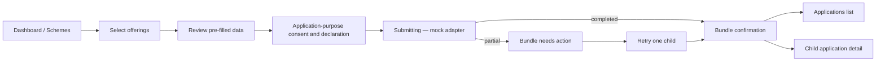

# KrishiSetu Second-Round UX, Route, and Complete-Flow Audit

**Status:** Implementation baseline for round three  
**Audit date:** August 22, 2026  
**Audited commit:** `caac1cc`  
**Scope:** web route integrity, UI/UX quality, responsive behaviour, application journey, notifications, privacy/consent, localization, and safe Gemini delegation  
**Safety boundary:** all identities, records, weather, notices, decisions, receipts, and provider responses remain explicit synthetic mock data

## 1. Executive outcome

The second Gemini round materially improved the foundation: the monorepo builds, generated files have no drift, 66 tests pass, notification and weather presentation modules exist, four-language catalog parity is enforced, and the dashboard now uses typed synthetic view models in several areas.

It is not yet a workable end-to-end service. The production route table contains only `/`, `/{locale}`, and the framework not-found route. Consequently the header logo, Dashboard, My Applications, and Privacy & Consent links point to pages that do not exist. The user-reported “400” issue is reproducible as **404 Not Found** for `/en/dashboard`, `/en/applications`, and `/en/privacy`, with the same architectural problem in Marathi, Hindi, and Kannada.

The current happy path is a single client component switching views with `useState`. It changes the visible screen without changing the URL, cannot survive refresh or direct linking, skips application review and confirmation steps, and immediately presents a completed mock receipt. Privacy controls are not reachable through working navigation, accessibility preference toggles do not affect the interface, and the withdrawal UI claims that records were deleted although no purge workflow ran.

Round three should therefore prioritize service integrity over adding more dashboard content:

1. create a real locale-aware route surface;
2. establish an honest prototype journey adapter outside React components;
3. implement the complete application presentation flow;
4. repair privacy and consent semantics;
5. wire every visible link, button, tab, card action, dialog action, and language change to a testable outcome;
6. modernize the shell and dashboard with calmer hierarchy and responsive task-first layouts;
7. add route, interaction, accessibility, and viewport tests.

## 2. Verified evidence

### 2.1 Automated gates

The following commands were run from the repository root against the audited commit:

| Command | Result |
|---|---|
| `npm run validate:foundation` | Pass |
| `npm run codegen:check` | Pass; zero generated-file drift |
| `npm run typecheck` | Pass |
| `npm test` | Pass; 66 tests, 0 failures |
| `npm run build` | Pass for all workspaces |

The Next.js production build reported exactly this application route surface:

```text
/
/_not-found
/{locale} -> /en, /mr, /hi, /kn
```

No nested dashboard, applications, privacy, notices, weather, scheme, or application-detail route exists.

### 2.2 Browser audit

The running site was inspected in the in-app browser at desktop and 360 × 800 mobile dimensions.

Verified behaviour:

- `/en` renders the login screen.
- `/en/applications`, `/en/privacy`, and `/en/dashboard` render the Next.js 404 page.
- login validation works for an invalid PIN and the valid synthetic PIN advances to consent.
- consent starts with all six visible scopes selected.
- granting consent advances to the dashboard without changing `/en`.
- selecting Marathi changes visible catalog text and future link targets to `/mr/...`, but the address remains `/en`; refresh therefore loses the choice and the document locale can disagree with the displayed language.
- “Review & Apply Selected” bypasses review, declaration, and submission states and immediately shows a completed application bundle while the URL remains `/en`.
- the Marathi application receipt contains substantial hardcoded English copy.
- the mobile sticky application bar occupies a large part of the viewport and obscures dashboard content while scrolling.

### 2.3 What round two did well

- Package build and enforcement failures from the first audit were repaired.
- Public notices and weather are isolated behind public module contracts and typed fixtures.
- The dashboard gets its main synthetic record from an explicit typed view model.
- Weather cards provide both visual and tabular forecasts.
- Prototype disclosure remains persistent.
- Architecture tests now reject deep imports, direct `process.env`, raw colors, prohibited emblem assets, and executable live provider URLs.
- Locale catalogs maintain namespace and interpolation parity for `en`, `mr`, `hi`, and `kn`.

These improvements should be preserved; round three is an extension and repair, not a rewrite.

## 3. Findings by priority

### P0 — all primary authenticated navigation routes are missing

`AppShell` renders anchors for Dashboard, My Applications, and Privacy & Consent and makes the wordmark link to the dashboard. All four targets are absent from the App Router. `onNavigate` is declared but unused. This creates broken global navigation and makes direct links, refresh, history, bookmarks, and automated page testing impossible.

**Decision:** create explicit route files. Do not hide the defect with one catch-all page or convert navigation anchors into state-setting buttons.

### P0 — no complete application flow exists

The dashboard’s apply action transitions directly to a static, completed receipt. There is no scheme detail, review, change action, declaration, submitting state, recoverable error state, confirmation page, applications index, bundle detail, or child application detail. The partial/retry branch exists in component code but cannot be reached through the UI.

**Decision:** implement a complete, deterministic presentation journey using a mock adapter. Every stage must be a real route and must support back/refresh behaviour appropriate to a prototype.

### P0 — privacy withdrawal overstates what happened

The Privacy view shows hardcoded deletion counts, calls the result a purge receipt, and redirects to login after a timer. No API, consent artefact, retention policy execution, cache deletion, receipt pseudonymization, or audit event is invoked.

**Decision:** the UI may simulate and demonstrate the intended sequence, but must label the result “Prototype withdrawal simulation” and say “No real personal data was stored or deleted.” It must not claim that records were actually purged. Real consent revocation and purge orchestration remain senior-owned.

### P0 — interactive contract is incomplete

Several visible controls are dead, unreachable, or only open a generic modal:

- global navigation and home link lead to 404;
- notification actions have no route-specific outcome when `onOpenNotice` is not supplied;
- notice list items have no dedicated detail page;
- application result cards have no view-details action;
- privacy is unreachable from the current state machine;
- accessibility toggles update local booleans but do not alter the root UI;
- locale selection changes component state but not the URL;
- retry states exist but have no discoverable scenario.

**Decision:** an interactive element is complete only if it causes a documented route transition, data/state transition, disclosure, download, dialog, validation response, or preference change. Toast-only, console-only, and no-op controls fail acceptance.

### P1 — consent is preselected and not sufficiently purpose-specific

All visible consent scopes are selected on entry. The page allows a grant with no user review step and does not clearly distinguish the minimum scopes required to show the dashboard from the additional scopes required to apply for subsidy or credit. This weakens the “free, specific, informed, unconditional and unambiguous” affirmative action required by section 6 of the DPDP Act.

**Decision:** start optional scopes unselected, explain purpose and consequence beside each group, require an affirmative selection, show a concise review, issue a clearly labelled synthetic consent artefact, and make withdrawal as easy to find as grant. Application-purpose consent must be requested at application time if it is broader than dashboard consent.

### P1 — the shell is clean but visually dated and inefficient

The service header uses substantial vertical space, separates brand and navigation into multiple bands, keeps protected navigation visible on the signed-out login screen, and uses emoji as civic navigation icons. The dashboard then presents several bordered panels of similar weight, exposing technical provider latency before the farmer’s most important tasks.

**Decision:** modernize by improving hierarchy, density, spacing, and responsive composition—not through gradients, glass effects, animation, oversized typography, or decorative charts.

### P1 — the mobile action bar blocks content

At 360 × 800 the sticky selection bar wraps into a tall card with two text lines and a full-width button. It covers a significant part of land, crop, and weather content while the page scrolls.

**Decision:** on narrow screens use a compact bottom action area with one-line selection summary and CTA, reserve safe bottom padding equal to the bar height, and allow it to collapse when nothing is selected. Verify at 320, 360, and 390 CSS pixels and at 200% zoom.

### P1 — localization stops at catalog substitution

Names, villages, status labels, technical headings, application copy, offer selection copy, dates, crop keys, provider descriptions, and CTA copy remain hardcoded. The URL and interface language can diverge. The root document language is not verified to update for nested locales.

**Decision:** the URL is the locale source for anonymous navigation. Language switching must preserve the logical route and route parameters while replacing only the locale segment. No user-visible string belongs inline in feature JSX. English remains canonical and fallback; Marathi, Hindi, and Kannada require native review disclosure.

### P1 — presentation logic remains concentrated

`DashboardView` remains a very large inline-style component. It owns selection state, timeout simulation, notice modal state, hardcoded integration labels, domain-looking explanations, and the sticky action bar. Applications and Privacy similarly combine fixture values, transient state, and rendering.

**Decision:** extract route-level page composition, feature sections, pure view models, and a prototype adapter. Do not move real business decisions into hooks or client context.

### P2 — progress evidence is stale

The implementation progress document still reflects older test counts and earlier framework/foundation status.

**Decision:** update it only after the third-round gates run, listing implemented, simulated, deferred, failed, and untested items separately.

## 4. Research-backed UX direction

The recommendations below are grounded in official public-service patterns, adapted to KrishiSetu’s mock-only constraint.

- [UX4G accessibility guidance](https://www.ux4g.gov.in/foundations/accessibility) requires semantic navigation, visible focus, complete keyboard operation, correct heading hierarchy, live status communication, and focus-managed dialogs. It explicitly distinguishes anchors for navigation from buttons for actions.
- [UX4G navigation guidance](https://doc.ux4g.gov.in/components/navs-and-tabs.php) requires `aria-current` for the active page and reserves tab semantics for controls that dynamically change a panel. KrishiSetu’s Dashboard, Applications, and Privacy destinations are pages, so they must be links, not faux tabs.
- The [UX4G Handbook](https://www.ux4g.gov.in/assets/img/pdf/UX4G-Handbook.pdf) recommends steppers for longer forms, visible position/progress, concise validation near fields, mobile-appropriate inputs, and adequately sized touch controls.
- [GIGW 3.0 resources](https://guidelines.india.gov.in/) explicitly include broken-link validation, mobile friendliness, semantic markup, accessible forms, and screen-reader access. A route-integrity test is therefore a compliance feature, not merely developer convenience.
- The [DPDP Act, 2023](https://www.meity.gov.in/static/uploads/2024/02/Digital-Personal-Data-Protection-Act-2023-1.pdf) requires clear/plain language, purpose limitation, affirmative consent, language access, and withdrawal with ease comparable to grant.
- The [GOV.UK check-answers pattern](https://design-system.service.gov.uk/patterns/check-answers/) provides a useful global civic benchmark: show a review page before submission, use specific submit copy, let users change sections, and preserve earlier answers.
- The [GOV.UK complete-multiple-tasks pattern](https://design-system.service.gov.uk/patterns/complete-multiple-tasks/) supports a status-bearing task list when a transaction has multiple sections. For KrishiSetu, a short three- or four-step indicator is preferable to a permanent site nav during focused application submission.
- The [GOV.UK service-navigation pattern](https://design-system.service.gov.uk/patterns/navigate-a-service/) recommends simplifying focused journeys and keeping global navigation limited to useful top-level destinations.

## 5. Target route architecture

All locale segments are generated from the locale registry. Unknown locales use the existing not-found boundary; known routes must never 404.

```text
app/
├── page.tsx                              -> redirect to /en
└── [locale]/
    ├── layout.tsx                        -> locale shell/provider boundary
    ├── page.tsx                          -> start/login
    ├── consent/page.tsx                  -> dashboard-purpose consent
    ├── dashboard/page.tsx                -> authenticated prototype dashboard
    ├── schemes/page.tsx                  -> available synthetic offerings
    ├── schemes/[schemeCode]/page.tsx     -> scheme facts and select/apply action
    ├── applications/page.tsx             -> application list and empty state
    ├── applications/new/review/page.tsx  -> check selected services/data
    ├── applications/new/declare/page.tsx -> declaration and final action
    ├── applications/new/submitting/page.tsx -> accessible processing state
    ├── applications/[bundleId]/page.tsx  -> confirmation/bundle status
    ├── applications/[bundleId]/[childId]/page.tsx -> child detail/retry
    ├── notifications/page.tsx            -> durable notification centre
    ├── notices/[noticeId]/page.tsx       -> notice facts and internal action
    ├── weather/page.tsx                  -> district forecast/advisory details
    └── privacy/
        ├── page.tsx                      -> consent/privacy overview
        ├── consent/page.tsx              -> active synthetic artefact details
        └── withdrawal/[receiptId]/page.tsx -> honest simulation receipt
```

### 5.1 Route rules

- Use Next.js links for navigation and buttons for actions.
- Render `aria-current="page"` on the active navigation link.
- During login/consent/application submission, hide unrelated protected navigation and provide a clear Back or Save-and-return path.
- A direct visit to a protected prototype page without the in-memory demo session renders a localized “Start the demo to view this page” access-required page with one working CTA; it does not 404 and must not masquerade as real authentication.
- Route refresh must render a safe state. It may restore only non-sensitive prototype selections from an explicitly scoped prototype adapter; never store PINs, tokens, unmasked identifiers, consent evidence, or financial details in browser storage.
- Language switching preserves the logical route, IDs, query, and hash and replaces only the locale segment.
- Each route owns metadata, one `h1`, loading state, error state, and not-found behaviour for unknown synthetic IDs.

## 6. Complete application presentation flow

The third round may implement the presentation and deterministic mock-adapter behaviour below. It must not implement real eligibility, lending, provider submission, consent purge, or production persistence.



### 6.1 Journey contract

1. **Select:** no offering is preselected. The farmer chooses one or more synthetic schemes/credit offerings. Each card has “View details” and a labelled checkbox or add/remove action.
2. **Review:** show farmer summary, selected offerings, prefilled land/crop/bank fields, data source/prototype labels, and a Change link per section. Do not require re-entry of data already available in the synthetic view model.
3. **Consent and declaration:** request only additional application-purpose scopes. Start optional scopes unchecked. Explain consequence in plain language. The declaration must be a separate affirmative checkbox.
4. **Submit:** the CTA says exactly what occurs, for example “Submit 2 prototype applications.” Disable duplicate clicks and announce progress with `role="status"`.
5. **Mock response:** call the injected `PrototypeApplicationAdapter`, not a timer in JSX. The adapter returns a typed deterministic scenario: `COMPLETED`, `PARTIAL_RETRYABLE`, or `UNAVAILABLE`.
6. **Confirmation:** show a prominent prototype confirmation panel, bundle ID, submitted time from the shared Clock, selected services, child statuses, and next actions. State clearly that nothing was sent to a government department or bank.
7. **Applications index:** show status filters as accessible controls, an empty state, bundle summaries, last updated time, and working detail links.
8. **Child detail:** show timeline, synthetic reference, submitted fields, next step, and retry only when the typed scenario permits it.
9. **Retry:** retry only the failed child through the mock adapter. Preserve the successful child and make idempotent presentation behaviour visible.

### 6.2 Prototype adapter boundary

Create a small app-composition interface, for example:

```ts
export interface PrototypeJourneyAdapter {
  startSession(personaId: string, pin: string): Promise<PrototypeSessionResult>;
  grantDashboardConsent(input: PrototypeConsentInput): Promise<PrototypeConsentResult>;
  submitBundle(input: PrototypeBundleInput): Promise<PrototypeBundleResult>;
  retryChild(bundleId: string, childId: string): Promise<PrototypeBundleResult>;
  simulateWithdrawal(consentId: string): Promise<PrototypeWithdrawalResult>;
}
```

The in-memory implementation returns typed fixture results using shared `Clock` and deterministic IDs. Components receive results through page composition. This keeps mock orchestration out of React rendering and leaves a replaceable seam for later senior-owned use cases.

## 7. Privacy and consent flow

### 7.1 Grant

- Show a short purpose summary first.
- Group requested data by purpose, not by provider name.
- Display required and optional scopes explicitly.
- Do not preselect optional scopes.
- Provide “Continue without sharing” with a plain explanation of the reduced experience.
- Provide links to scope details and the prototype privacy overview.
- On grant, show a compact synthetic consent summary with purpose, scope, issued time, expiry, and withdraw link.

### 7.2 Review and withdraw

- Privacy overview shows active and expired synthetic artefacts, what each enabled, and a clearly visible withdraw action.
- The confirmation dialog states the consequence before the action and manages focus correctly.
- The mock adapter returns a `SIMULATED` result only.
- The receipt route says: “Prototype withdrawal simulated. No real personal data was stored or deleted.”
- It may list what a production purge *would target* as a design demonstration, but not report fabricated deletion counts as completed facts.
- The action ends the prototype session and offers a working “Return to start” link.

Accessibility preferences should live under a separate Preferences heading. High contrast and reduced motion controls must apply real root attributes/classes, produce a visible result, and be keyboard operable. If persistence is added, store only the preference values.

## 8. Modern, not fancy: UI blueprint

### 8.1 Service shell

- Keep the persistent prototype disclosure, but make it a compact phase banner.
- Use a compact brand row with the approved KrishiSetu SVG mark, product name, motto, language action, notification action, and prototype account summary.
- Do not use the State Emblem or imply government ownership.
- Replace emoji with a small consistent set of accessible inline SVG icons. Decorative icons use `aria-hidden`; icon-only actions have accessible names.
- Hide authenticated navigation while signed out. On desktop, use a compact horizontal or left-rail navigation for Dashboard, Applications, Notices, and Privacy. On mobile, use a labelled menu or carefully tested four-item bottom navigation; do not duplicate both.
- Keep the current section visible through `aria-current`, color, weight, and position—not color alone.

### 8.2 Dashboard hierarchy

Order the page around farmer tasks:

1. greeting, village, masked ID, and notification count;
2. “What needs your attention” with at most three action rows;
3. “Continue or start an application” with application status and available services;
4. compact land/crop/bank readiness summary;
5. district weather and agromet advisory;
6. public notices;
7. collapsed technical/prototype evidence.

Provider latency belongs only in the collapsed technical area. Reduce the number of equal-weight bordered cards: use spacing, headings, dividers, and soft surfaces to create hierarchy. Use an 8/4 desktop grid, one column on mobile, and two columns only where content remains readable.

### 8.3 Cards and actions

- Each card has one primary purpose and at most one prominent CTA.
- Entire cards are not clickable unless they have one unambiguous destination; otherwise use explicit links/buttons.
- Use concise status text: “Ready”, “Needs action”, “Submitted”, “Unavailable”. Keep “mock” visible in provenance, not repeated as visual noise in every label.
- Place deadlines beside the action they affect and use absolute localized dates.
- Avoid decorative charts. Weather visual cards retain a table alternative.
- Skeletons are optional; honest loading text and stable layout are required.

### 8.4 Responsive requirements

Verify at 320 × 568, 360 × 800, 390 × 844, 768 × 1024, 1024 × 768, and 1440 × 900, plus 200% browser zoom.

- no horizontal page scroll;
- no grid minimum wider than the available content box;
- minimum 44 × 44 CSS-pixel targets;
- base body 16px, legal floor 12px, line-height at least 1.5;
- forms use one column on narrow screens;
- sticky actions reserve matching page bottom padding and never hide focused controls;
- dialogs fit the viewport and retain a visible close/cancel action;
- long Marathi/Hindi/Kannada labels wrap without overlap or truncation;
- focus remains visible and is never hidden behind fixed UI.

## 9. Interaction contract

| Surface | Control | Required result |
|---|---|---|
| Header | wordmark | navigate to locale dashboard when session exists, otherwise locale start |
| Header | primary nav | navigate to an existing route; active item has `aria-current` |
| Header | language | replace locale segment and retain logical destination |
| Login | enter | validate; show field/error summary or navigate to consent |
| Consent | scope control | update review summary; optional scopes begin unchecked |
| Consent | continue without sharing | return to safe reduced/start route with explanation |
| Consent | grant | call prototype adapter, announce result, navigate to dashboard |
| Dashboard | action item | navigate directly to its notice/scheme/application destination |
| Dashboard | notification count | navigate/open an accessible durable notification surface |
| Dashboard | data details | expand/collapse with correct `aria-expanded` and focus behaviour |
| Scheme card | view details | open existing scheme route |
| Scheme card | include/remove | update selection and accessible count |
| Apply bar | review | navigate to review route; never submit immediately |
| Review | change | return to the relevant selection/section with state preserved |
| Review | continue | navigate to declaration |
| Declaration | submit | call mock adapter once; loading, success, partial, unavailable supported |
| Confirmation | application detail | navigate to bundle/child route |
| Applications | filter | update visible list and URL query where useful |
| Applications | retry | retry one permitted child and announce outcome |
| Notice | action | internal scheme/form/application route exists |
| Weather | table/cards | switch accessible representation; selection state exposed |
| Privacy | view consent | navigate to artefact details |
| Privacy | withdraw | focus-managed confirmation then honest simulation receipt |
| Preferences | high contrast/reduced motion | visibly change root presentation and remain operable |

Any rendered interactive element absent from this table must receive its own explicit contract before implementation.

## 10. What can safely be delegated to Gemini 3.7 Flash High

### Green — delegate now

- create the explicit Next.js route folders and route-level page composition;
- replace client-only view switching with links/router transitions;
- implement active responsive service navigation and access-required states;
- split the dashboard into smaller presentation sections;
- build scheme list/detail, application review, declaration, submitting, confirmation, index, bundle detail, and child detail pages;
- build notice detail and weather detail pages from existing synthetic contracts;
- implement typed synthetic page fixtures and a deterministic in-memory `PrototypeJourneyAdapter` behind an interface;
- wire every CTA according to the interaction contract;
- remove inline user-visible strings and add parity-safe message keys for four locales;
- replace emoji with simple repo-native SVG icon components;
- implement responsive CSS using existing tokens;
- add route existence, component interaction, keyboard, locale-switch, and viewport tests;
- update progress evidence after gates pass.

### Amber — delegate with explicit constraints and senior review

- prototype session composition and access guards;
- browser preference persistence for contrast/motion only;
- partial/retry presentation scenarios;
- simulated consent and withdrawal artefact views;
- draft Marathi, Hindi, and Kannada operational UI copy.

These must remain clearly synthetic, isolated behind interfaces, and must not establish production security/privacy rules.

### Red — do not delegate in this round

- real authentication, authorization, cookies, sessions, CSRF, or secrets;
- real consent evidence, legal copy approval, revocation, erasure, retention, or audit orchestration;
- database schemas/migrations for identity, consent, applications, credit, or financial records;
- eligibility, benefit, credit-limit, interest, joint-ownership, or repayment calculations;
- the real multi-provider application saga, idempotency, compensation, or retry policy;
- production API clients or any government, bank, Aadhaar, IMD, SMS, email, WhatsApp, Maps, or geolocation integration;
- production deployment, analytics, tracking, or external asset/CDN use;
- architectural changes to module ownership, stack, contracts, or security policy.

## 11. Ordered implementation packets

### Packet A — route integrity and shell

- add all route files in section 5;
- redirect `/` to `/en` using the locale registry default;
- add access-required, loading, error, and unknown-synthetic-ID states;
- make global links and locale switching route-aware;
- condition navigation on prototype journey state;
- add a route-manifest test for all locales.

**Exit:** every header link and declared route returns a real page; refresh and history are safe; no primary route 404s.

### Packet B — modern responsive composition

- compact the shell and authenticated navigation;
- replace emoji with SVG icons;
- reorder dashboard around actions;
- extract CSS/classes and presentation sections;
- repair the mobile sticky bar and grid minimums;
- keep technical integration evidence collapsed.

**Exit:** required viewports and 200% zoom show no obstruction or overflow; keyboard focus is visible.

### Packet C — complete application presentation flow

- add scheme facts, selection, review/change, declaration, submitting, completed, partial, unavailable, index, bundle, and child-detail surfaces;
- add the prototype adapter and deterministic scenarios;
- make no offering or declaration preselected;
- preserve selection between steps;
- add accessible status announcements and duplicate-submit prevention.

**Exit:** a user can complete the entire synthetic journey, inspect both child results, retry the retryable child, return to the application list, refresh safely, and never encounter a dead action.

### Packet D — consent, privacy, and preferences presentation repair

- make consent purpose-specific and non-preselected;
- add review/details routes;
- replace fabricated purge completion with honest simulation language;
- make accessibility toggles produce a real visible result;
- add focus-managed dialogs and receipt page.

**Exit:** grant/review/withdraw are understandable and reachable; no UI claims real deletion or legal-grade consent.

### Packet E — notices and weather destinations

- add notification index, notice detail, and weather detail routes;
- connect every dashboard notice/weather action to its destination;
- add expired/superseded/archive/unavailable states;
- retain table alternative for forecast.

**Exit:** every notice/weather control has a meaningful result; no external provider call exists.

### Packet F — interaction and evidence gate

- inventory all anchors, buttons, checkboxes, selects, details, dialogs, and tabs;
- add automated interaction coverage from the contract table;
- test all four locale route variants;
- test 320/360/390 mobile and desktop breakpoints;
- test keyboard journey, dialog focus return, semantic headings, `aria-current`, live regions, and reduced motion;
- run broken-link and untranslated-key scans;
- update progress documentation truthfully.

**Exit:** zero known dead controls, zero internal broken links, all required commands pass, and skipped manual checks are listed.

## 12. Acceptance gates

Run and report exact results:

```bash
npm run validate:foundation
npm run codegen:check
npm run lint
npm run typecheck
npm test
npm run build
git diff --check
```

Add a web route/interaction suite that proves at minimum:

- every declared public route renders for `en`, `mr`, `hi`, and `kn`;
- global navigation has no broken internal href;
- locale switching preserves the page;
- valid login, consent, dashboard, selection, review, declaration, mock submit, confirmation, application detail, and return journey works;
- signed-out direct navigation shows access-required, not 404;
- partial child retry preserves the successful child;
- consent withdrawal produces only an honest synthetic receipt;
- every dialog closes with Escape and returns focus;
- keyboard-only operation reaches every action;
- required viewport matrix has no horizontal overflow or content hidden behind sticky UI.

Manual native-language review and real assistive-technology testing must be recorded as pending unless actually completed.

